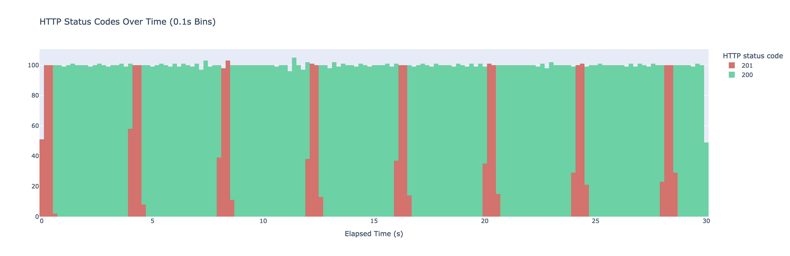
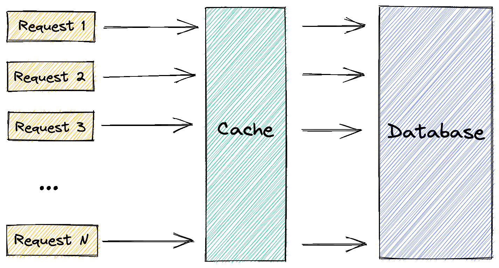
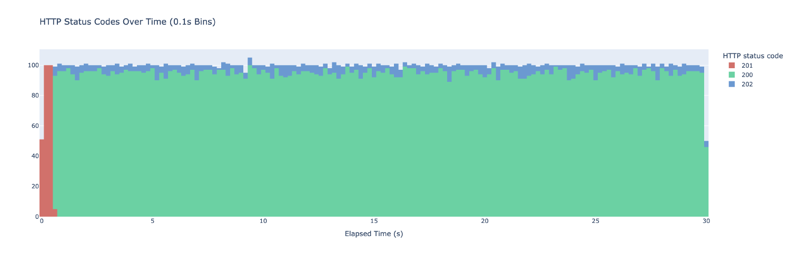

<!-- _class: lead -->

<style>
h1 {
    font-family: Roboto Slab;
    color: #056210;
}
p {
    font-family: Roboto Slab;
}
</style>

# Caches are cool

…and why to avoid them.


----

<!-- paginate: true --->

# Some Quotes

>Caches are bugs waiting to happen.
>— Rob Pike

>There are 2 hard problems in computer science: cache invalidation, naming things, and off-by-1 errors.
>— Phil Karlton / Leon Bambrick

>There's no such thing as a simple cache bug.
>— Rob Pike

<!--
Apparently experienced developers are not regarding caches very highly.
Why is that? Enough reason to make a small academy about it!
-->

----

# Use cases

```go
// Caches speed up retrieval from a slow data source. A generic one could look like this:
type Cache interface {
  Get(key string) (any, bool)
  Set(key string, val any, ttl time.Duration)
  Del(key string) bool
}
```

Examples:

- **CPUs** (L1, L2, L3, RAM, Disk, Network)
- **Webapps** (Cookies, Requests)
- **DNS** (Hierarchy cache)
- **OS Page cache** (memory pages)

<!--
-->

----

# Avoiding?

Caches are **not architecture**. They're **optimization**.

Problems of the past:

- Ctrl-F5
- Spectre / Meltdown
- DNS Spoofing


<!--
Caches are not architecture. They are always optimizations. Like all
optimizations: Only use it if you measured that you have a problem. There are
obvious cases though and sometimes you should at least consider making room for
it in your design.

Even hardware can have bugs, as seen by Intel CPUs - and we keep finding new issues related
to the decision of having memory prefetched into caches.

The most common rage quit of developers if probably the browser cache.
It's one of those caches that are purely there for optimization and they can't really know
if the web page in question has changed.

Especially in terms of security they can pose a risk.
DNS Spoofing is only feasible, because attackers can intercept DNS requests and answer
with a fake one that is then stored in the requester's cache.
Waiting for DNS requests all the time would not be nice too though.
-->

---

# Basics

- Unique Keys, sometimes hierarchic
- Eviction (Size / TTL)
- Hit/Miss
- Warm/Cold

Types:

- Memory (e.g. hash table / btree)
- Shared (`shmem`, `mmap`)
- Remote (`memcached`, ...)
- Persistent (Redis, ...)

---

# HTTP Example

```go
func expensiveOp(path string) string {
  time.Sleep(time.Second)
  return "result_of_" + path
}

func handler(w http.ResponseWriter, r *http.Request) {
  // Key is unique per request path!
  w.Write([]byte(expensiveOp(r.URL.Path)))
}

func main() {
  http.ListenAndServe("localhost:8000", http.HandlerFunc(handler))
}
```

----

# Adding a basic cache

```go
var cache map[string]string

func handler(w http.ResponseWriter, r *http.Request) {
  v, ok := cache[r.URL.Path]
  if !ok {
    v = expensiveOp(r.URL.Path)
    cache[r.URL.Path] = v
  }

  w.Write([]byte(v))
}
```

<!--
What are the problems in this approach?

- No eviction strategy (neither TTL nor size)
- Unbounded size - easily DDoS-able
- No persistence.

We need some form of cache entry invalidation!
-->

---

# Cache Invalidation

Reasons for invalidation of an entry:

- TTL is too late
- Size Overflow on inserting a new entry.
- Writeback: An entry got updated in the data source.

Mimick the data sources API so the caller does not need to know there is a cache!

<!--
Failure in proper writeback is the prime reason why bugs exist.
There often exists ways to bypass the control of the cache.

To avoid bugs we should always strive to make all communication through the cache.
This should be made as easy as possible by mimicking the data sources API so that
there is no reason to 

Limiting size and TTL also help to make the impact of bugs less heavy,
as we at least make sure the new values will eventually show up. This is often good enough.
-->

----

# Eviction Strategies

- FIFO: Oldest one gets kicked out.
- LRU: Least Recently Used gets kicked out.
- LFU: Least Frequently Used gets kicked out.
- LRFU: LFU+LRU (adjust counters over time)
- Random: Silly, but good performance base line.

[(Wiki)](https://en.wikipedia.org/wiki/Cache_replacement_policies)

<!--
You could think of a lot more, but those are the typical ones.

There's even an wiki page for some more details:
https://en.wikipedia.org/wiki/Cache_replacement_policies

How would you implement it? There are a ton of libraries for each of those.
-->

----

# (In)Consistency & Persistence

- All access must go through the cache, otherwise things get invalid if changed in the db without telling the cache.
- Distributed consistency is even harder.
- No persistence **should be the default**.

----

# Problem: Periodic cache misses



----

# Stampede



```go
type entry struct {
  Data  string        // data, as before.
  TTL   time.Duration // the TTL
  Delta time.Duration // how expensive is the op?
}

func (e *entry) shouldUpdate() {
  beta := 1.0 // higher -> earlier expiry
  now := time.Now() // algorithm is called "XFetch"
  scaledGap := pv.Delta.Seconds() * beta * math.Log(rand.Float64())
  return now.Add(-pv.TTL).Seconds() >= scaledGap
}

func handler(w http.ResponseWriter, r *http.Request) {
  e, ok := cache[r.URL.Path]
  if !ok || e.shouldUpdate() {
    now := time.Now()
    v := expensiveOp(r.URL.Path)
    cache[r.URL.Path] = entry{
      Data:  v,
      TTL:   10 * time.Second,
      Delta: time.Since(now),
    }
  }

  w.Write([]byte(e.Data))
}
```

<!--
Solution: Probabilisitic early pre-fetch with XFetch

-->

-----

# Stampede solution & Prefetch



<!--
Only problem now: The first requests hit a cold cache that needs to warm up.
This is usually fine. In the unlikely case it isn't, you might need to pre-fetch 
typically used keys by a heuristic.
-->

----

# Negative caching

Asking for data that is not in the system at all: This would cause us to traverses all hierarchies.

Solution: Keep a cache for typical misses (e.g. separate cache, bloom filter or store null values for non-existing ones)

----

# Cache Hierarchy


<!--
Sometimes: Caches with slightly different contents.

Examples: 

- DNS
- CPU
- dashboard service
- backend: CDN + mem,redis,database

Often used in distributed systems where you have several services that might
have small local caches and bigger, persistent ones like Redis.
-->

----

# Homework

Write a cache in your favorite language:

- Evict by least recently used and by least frequently used.
- `O(1)` on `Get()`, `Set()`, `Del()`
- Benchmark your implementation.

---

# Good libraries & Tools

- <https://github.com/eko/gocache>
- <https://github.com/allegro/bigcache>

TODO

----

<!-- _class: lead -->

# Questions?

----

# Sources

- <https://dizzy.zone/2024/09/23/Probabilistic-Early-Expiration-in-Go/>
- <https://en.wikipedia.org/wiki/Cache_(computing)>
- <https://cseweb.ucsd.edu/~avattani/papers/cache_stampede.pdf>
- Years of screaming at a computer.
