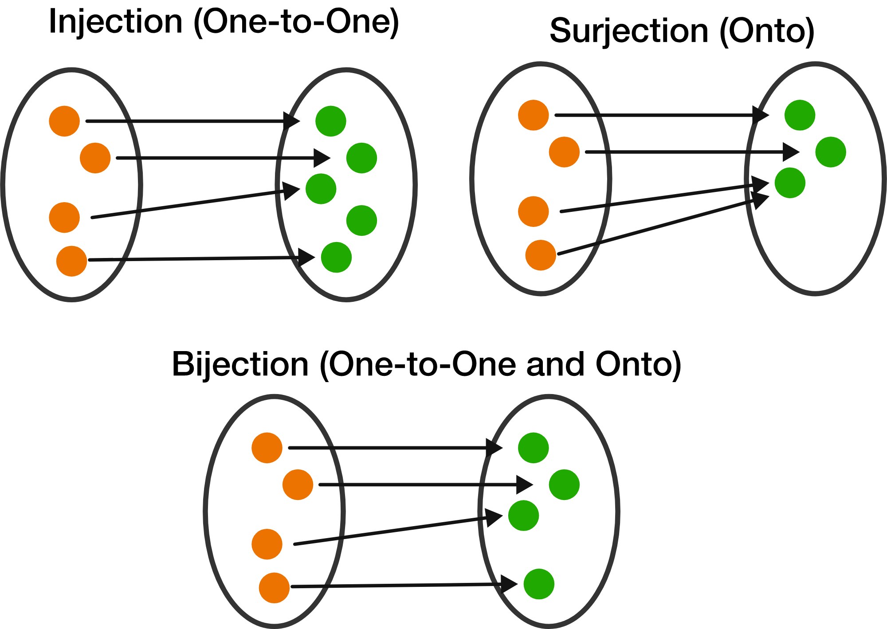
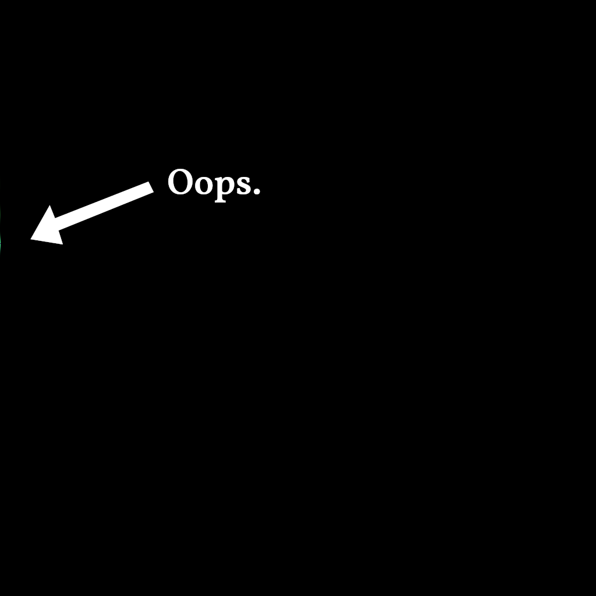
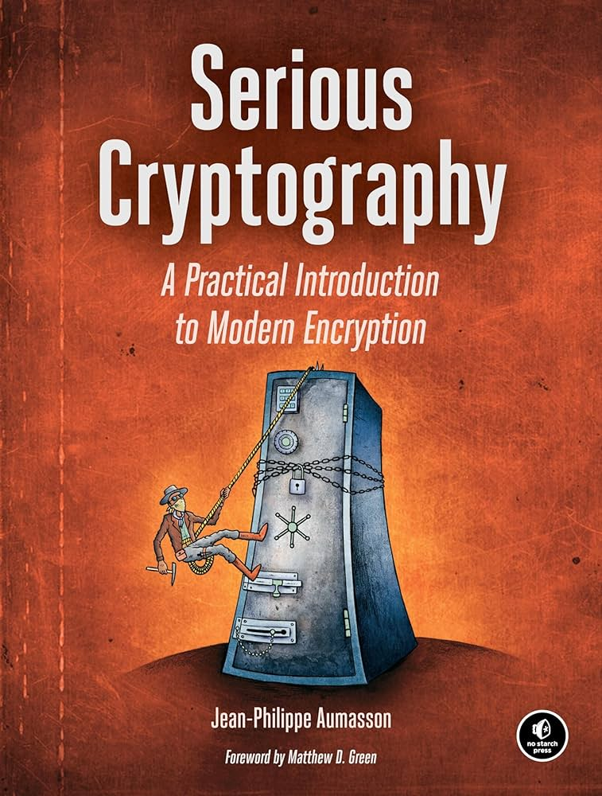
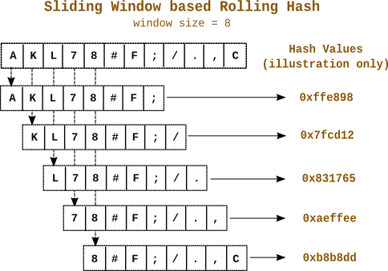
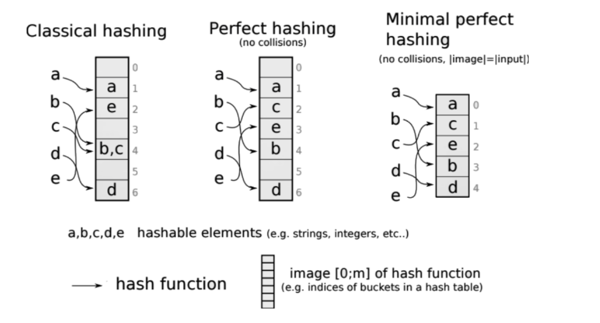

<!-- _class: lead -->

<style>
h1 {
    font-family: Roboto Slab;
}
p {
    font-family: Roboto Slab;
}
</style>

# How to choose a hash function

With flowchart and blockchains!


<!--
Agenda:

* What is a hash function?
* Why are they useful?
* Algorithm to choose an algorithm.
--->

---

# What is a function?

* $f(x) = x$
* $f(x) = 2x$
* $f(x) = \frac{2x−6}{3x+7}$
* $f(x) = sin(x)$



<!--

The first three functions have something in common:
You can get the input value easily by applying the inverse function to the output value.
For sin(x) that's not really possible, for larger numbers, as they always map to the same one.

Hash functions are not easily invertable and they map a big input set to a small output set.
They are surjective, but that's something you can forget easily.

-->

---

# What is a hash (code)?

<!--
in our context at least, hash can also mean hash brownies or minced meat...
On the right side you'll see what Google image search thinks a "hash" is.
-->

<style scoped>
h1 {
  font-size: 40px !important;
}
p {
  font-size: 20px !important;
}
</style>

Number with a fixed number of bits. Example:

`da39a3ee5e6b4b0d3255bfef95601890afd80709`

<!-- That above is the sha1 hash of an empty file
     Maybe one of the very few hash codes worth to recognize!
-->


---

# What is a hash function?

<!-- Now that we know what a function and what a hash is...
Since every data can be represented as number, we can see it as
mathematical function
-->

$h(x)$ maps arbitrarily sized numbers to a fixed number of bits...

* ...with minimum number of collisions.
* ...as uniform as possible.
* ...is not invertible, except by brute-force (*»preimage resistance«*)

---


<!--
We will come back to this image, since we first need to understand
the decisions we need to make.

Source for the diagram:

https://app.diagrams.net/#G11rSwTBF6jc5VIC4bXvHTUVJ2IJZM7aDa
-->

---

# Purpose

* Cryptography (e.g. for signatures or password hashing)
* Integrity checks (e.g. error detection)
* Hash tables, Merkle-Trees (`git`), Bloom filters, ...
* Identification (e.g. caching or deduplication)
* Synchronization (e.g. `rsync`)
* Scamming people with blockchains.

<!-- We will check some attributes of hash functions -->

---

# Uniformity

How well are the hash codes distributed?


<!--

Graphic: On the right side every pixel has an ID.
If you choose 5 million random values and light up every
pixel with that ID, then you get roughly that image.

The rainbow color is only to make it easier to see patterns
and because rainbows are cool

As you see, there are no patterns.
-->

---

# Uniformity: Sum it

```go
// Just sum the input bytes:
// "123" has the same hash as "321"
// Not many bits are used...
var h uint64
for _, c := range data {
    h += uint64(c)
}
```



---

# Uniformity: Multiplicative hashing

```go
const fib = 11400714819323198485
h := uint64(len(w))
for _, c := range data {
    h = h*fib + uint64(c)
}
```


---

# Uniformity: crc32


---

# Uniformity: fnv1a


<!-- that's the one we use for protobeef -->

---

# Uniformity: sha3


---

# Bit-size

Can be used to control the probability of collisions.


<!--
Cryptographic hash functions usually have a lot more.
Lowest is 128 bit (md5), sha1 is 160, most are bigger than 256.

Non cryptographic have usually <= 128 bit. Very often 32 bit or 64 bit
since they are often used in hash tables or algorithms.
-->

---

# Collisions

Usecases:

* `git`: Really bad if something collides. Security issue!
* **Caching:** Annoying to the user, but not really terrible.
* **Deduplication:** Does not matter a lot, if done right.


---

# Performance


Full list [here](https://rurban.github.io/smhasher/doc/table.html).

<style scoped>
table {
  font-size: 17px;
}
</style>

| Algorithm    |   MiB/sec  | Algorithm    | MiB/sec  |
| -------------|------------|--------------|--------- |
| MeowHash     | 29969.40   | FNV1a        | 760.52   |
| xxh128       | 18802.16   | sha1_64      | 575.68   |
| fibonacci    | 16878.32   | md5_64       | 351.01   |
| crc32        | 8403.09    | sha2-256     | 231.70   |
| Murmur3F     | 7623.44    | sha3-256     | 125.35   |
| blake3_c     | 1288.84    | argon2       | <0.1     |


<!-- Sometimes slow performance is a good thing
     as for example with key derivation function
     where you want an attacker to spend a lot of time.

     Examples would be scrypt or argon2

     It is important that the performance depends on
     the machine, as many modern hash algorithms utilize
     specialized machine instructions, baked into the CPU.

     Some hash algorithms are not suitable for certain platforms.
     We use FNV1a a lot, but the TI and Pi are not very good at it
     because they require a modulo operation, which is not supported
     in hardware on the Pi.
-->

---

# Cryptography

Important aspects:

* Is it standard? (NIST)
* Are there any known attacks beyond brute force? (`MD5` 2011 †, `SHA1` 2017 †)
* Very high collision resistance.
* High-enough bit size (`> 256`)
* Can it be keyed/seeded?


<!--
In summary: If unsure: Make the hash string include the algorithm, so
you can easily switch it later. The big mistake of git.
-->



---

# Language support

* Good libraries available?
* Matches reference implementation?
* Is it supported in other environments? (`sha1sum` in bash)
* Streaming interface available?

    ```go
    type Hash interface {
        Write(b []byte) (int, error) // add content.
        Sum() uint64                 // return hash.
        Reset()                      // reset to zero.
    }

    // vs:
    Sum(data []byte) uint64          // all at once.
    ```

---

# Special case: Rolling Hash

<!--
Data that was added can be efficiently removed from the hash.

Programs like rsync use it to detect diffs in files and are thus
able to transfer only the parts of a file that actually changed.
--->



---

# Special case: Perfect Hash

<!--
perfect hash: specially constructed hash function for a known data set with no collisions.
-->



---


---

# Sources:

https://en.wikipedia.org/wiki/Hash_function
https://en.wikipedia.org/wiki/List_of_hash_functions
https://en.wikipedia.org/wiki/Hash_function_security_summary
