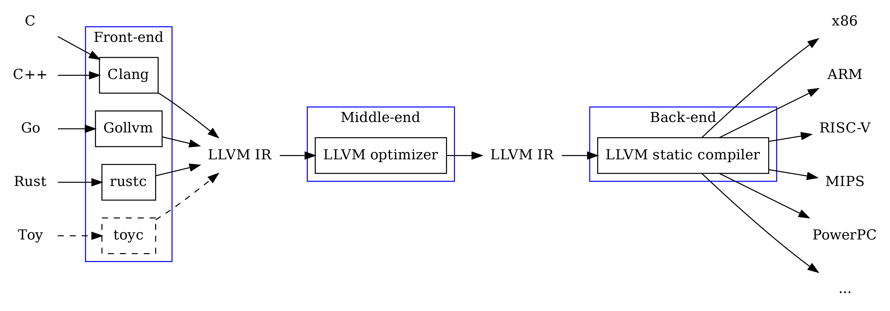
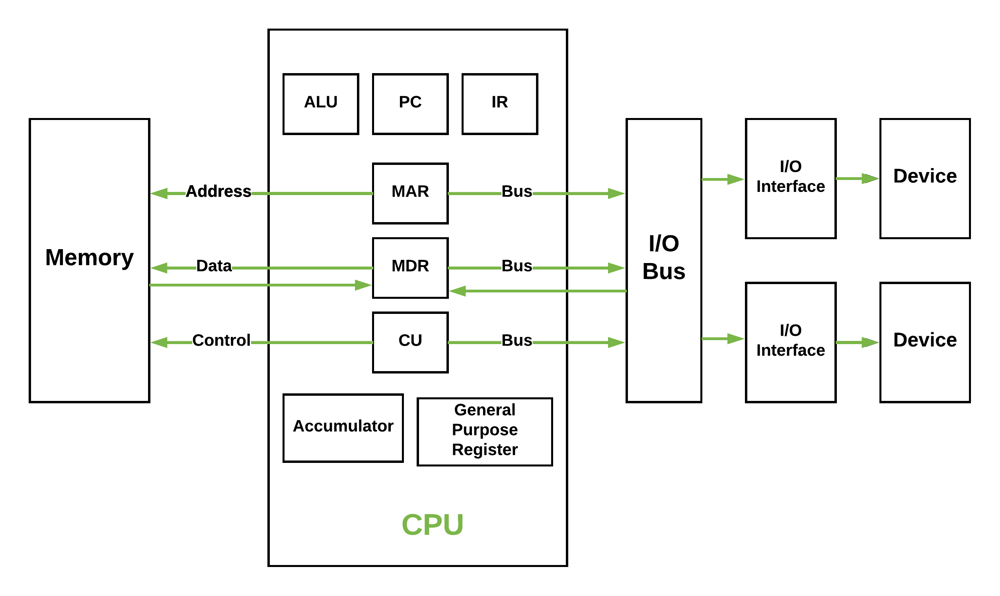
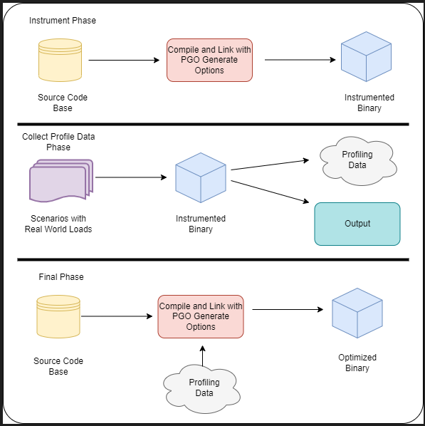
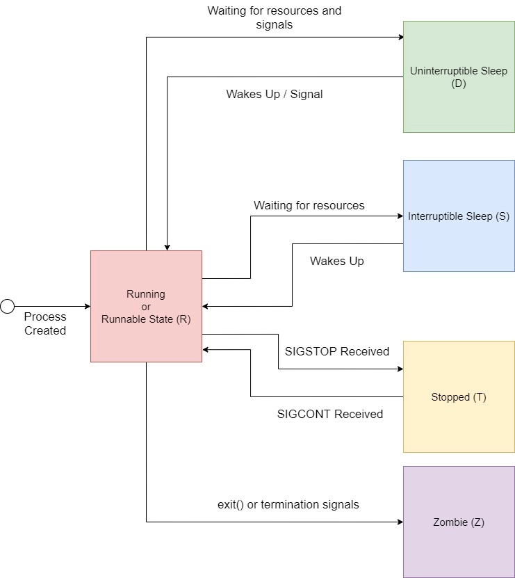

:title: Performance: CPU
:data-transition-duration: 1500
:css: hovercraft.css

Agenda
======

* From source code to machine code
* Hardware executing machine code
* Performance effects
* Profiling & Benchmarking

TODO: Link any code experiments to respective slides.
TODO: General slide about von Neumann Arch, re-order slides.

-----

:class: chapter-class

CPU
===

Quiz:

* If two programs A and B execute the same number of instructions will they have roughly the same runtime?
* If two CPUs have the same frequency, can we make assumptions based on their speed?

.. note::

   Answer no.

   Every instruction can take a different amount of cpu cycles.
   Every instruction can do a lot of different work (SIMD vs normal)

--------------

Compilers
=========

.. note::

   Steps to compile something:

   * Lexer/Tokenizer (break code in tokens)
   * Parser (build AST from code)
   * High Level IR (build generic language from it)
   * Low level IR (optimize and make it suitable for machines)
   * Convert to actual target machine code

--------------

Fun fact: Supercompilers
========================

.. note::

    * Compilers do not usually produce the best code and rely heavily on pattern matching, heuristics
      and just being smart. They can miss room for optimizations although this is rather rare in practice.
      (except Go, which is just a developing compiler)
    * Super compilers brute force compilation (sometimes with benchmarks) until they found the best performing
      piece of code.
    * Not used in practice, since freaking slow but helpful for developing new compiler optimizations.

   STOKE: https://github.com/StanfordPL/stoke

-----

How is code executed?
=====================

* Assembly: 1:1 human readable interpretation of machine code.
* Machine code: machine readable instructions (each instruction has an id)
* Assembler: Program that converts assembly to machine code.

.. note::

    * This slides could be also a talk about "Why interpreted languages suck"

        Most optimizations will not work with python.
        As a language it's really disconnected from the HW - every single statement will cause 100s or 1000s of assembly instructions.
        Also there are no almost no guarantees how big e.g. arrays or other data structures will be and how they are layout in memory.
        You have to rely on your interpreter (and I count Java's JIT as one!) to be fast on modern hardware - most are not and that's why
        there's so much C libraries in python, making the whole packaging system a bloody mess.

--------------

Other terminology
=================

* Instruction Set Architecture (x86, arm)
* RISC / CISC
* Microarchitecture / Microcode (``Pentium``, ``Coffee Lake``...)
* Instruction Set Extensions / SIMD (MMX, AES, SSE...)

.. note::

    Example of a CISC instruction set: x86
    Today, most complex operations get translated to RISC code though by the CPU.
    CISC turned out to be slower, surprisingly.

    RISC: ARM. Usually cheaper to build and also faster.

    Microarchitecture: Implementation of a certain ISA.

    ISE are not directly available in Go, only if the compiler decides to.

--------------

How is machine code stored? ELF!
================================

ELF (Executable and linkable format)

.. code-block:: bash

    $ readelf --sections /usr/bin/ls
    [...]
    [12] .text             PROGBITS         0000000000008020  00008020
    [...]
    [22] .data             PROGBITS         0000000000059000  00058000
    $ objdump --disassemble /usr/bin/ls

.. note::

   Beside storing the actual instructions ELF solves:

   * Storing debugging info
   * Making it possible to link with existing other libraries.
   * Includes a text (code) and data section (pre-initialized variables)
   * Different OS use different formats, but ELF is probably the most relevant for you
     and also the most widely known. Windows has a different one.

--------------

Go Assembler #1
===============

.. code-block:: go
   :number-lines: 1

    package main

    //go:noinline
    func add(a, b int) int {
        return a + b
    }

    func main() {
        add(2, 3)
    }

-----

Go Assembler #2
===============

Go assembly = assembler for a fantasy CPU

.. code-block:: bash

  main.add STEXT nosplit size=4 args=0x10 locals=0x0 funcid=0x0 align=0x0
  	(test.go:4)	TEXT	main.add(SB), NOSPLIT|ABIInternal, $0-16
  	(test.go:4)	FUNCDATA	$0, gclocals·g2BeySu+wFnoycgXfElmcg==(SB)
  	(test.go:4)	FUNCDATA	$1, gclocals·g2BeySu+wFnoycgXfElmcg==(SB)
  	(test.go:4)	FUNCDATA	$5, main.add.arginfo1(SB)
  	(test.go:4)	FUNCDATA	$6, main.add.argliveinfo(SB)
  	(test.go:4)	PCDATA	$3, $1
  	(test.go:5)	ADDQ	BX, AX
  	(test.go:5)	RET
  (...)

.. note::

    Important: Explain registers!

    Can we just say: To make things faster you have to reduce the number of instructions?

    Sadly no. Modern CPUs are MUCH complexer than machines that sequentially execute instructions.
    They take all kind of shortcuts to execute things faster - most of the time.
    See also: Megaherz myth (-> higher clock = more cycles per time)

    Effects that may play a role

    * Not every instruction takes the same amount of cycles (MOV 1 cycle,
    * Pipelining
    * Superscalar Execution
    * Branch prediction / Cache prefetching
    * Out-of-order execution
    * Cache misses (fetching from main memory mean

    List of typical cycles per instructions ("latency"): https://www.agner.org/optimize/instruction_tables.pdf

----

Von Neumann Architecture
========================

.. note::

    Greatly simplified.

    * Clocked with a certain frequency.
    * A cycle is the basic work synchronization.
    * Registers for internal usage. (CPUs have more than x86 says)
    * Peripherals look to the CPU like memory.

    Intel 8086 kinda worked this way.

----

Execution in the CPU
====================

What does it take to execute a single instruction?

* Load: Instruction gets loaded (0x012345)
* Decode: Check type of instruction and arguments.
* Memory: Load indirect data from memory (if necessary)
* Execute: Actually execute (e.g. add numbers in the ALU)
* Write back: Save the computed result in some register.

This would need 5 cycles per instruction.

----

Pipelining, OOO, Superscalar
============================

* Pipelining: All steps above can be done in parallel.
* Out-of-Order (OOO): Instructions can get re-ordered.
* Superscalar: several instructions per cycle (~5)

.. note::

    * Every instruction needs to do this
    * Modern CPUs can work on many instructions at the same time
    * They can be also re-ordered by the CPU!
    * This can lead to issues when an instruction depends on results of another instructions! (branches!)
    * It can even happen that we do unncessary work! See SPECTRE and MELTDOWN security issues!
    * CPUs can also execute more than one instruction per cycle (e.g. one MOV, ADD, CMP, as they all use different parts of the CPU)

    https://de.wikipedia.org/wiki/Pipeline_(Prozessor)

----

Disclaimer: CPU effects
=======================

* Modern CPUs are insanely complex.
* Modern compilers are insanely smart.

*Disclaimer:* This tandem is probably smarter than you.
The following slides are mostly for educational purpose.
Trust the compiler in 99% of the time.

----

Branch prediction
=================

... you can give hints to your CPU!

.. code-block:: c

    if(likely(a > 1)) {
        // ...
    }

    if(unlikely(err > 0)) {
        // ...
    }

.. note::

    Modern cpus guess what branch is taken due to pipelining. The accuracy is done to 96%,
    they even use neural networks for that.

    No likely() in Go, compiler tries to insert those hints automayically.
    Not much of an important optimization nowadays though as CPUs get a lot better:

    https://de.wikipedia.org/wiki/Sprungvorhersage

    (but can be relevant for very hot paths on cheap ARM cpus)

----

Branch prediction in real life
==============================

.. code-block:: go

    for(int i = 0; i < N; i++) {
        if (unsorted[i] < X) {
            sum += unsorted[i];
        }
    }

.. code-block:: go

    for(int i = 0; i < N; i++) {
        if (sorted[i] < X) {
            sum += sorted[i];
        }
    }

.. note::

   Effect is unnotice-able if optimizations are enabled.
   Why? Compilers can make the inner branch a branchless statement.

----

Go 1.20: Profile Guided Optimization
====================================

Idea:

* Let program run in analysis mode.
* Capture data about what branches were hit how often.
* Use this data on the next compile to decide which branch is likely!

.. note::

   Also decides on where to inline functions.

   https://tip.golang.org/doc/pgo

   Old news for languages like C.

----

Branchless programming
======================

.. code-block:: c

    int32_t max(int32_t a, int32_t b) {
        if(a > b) {
            return a;
        }
        return b;
    }

.. code-block:: c

    return (a > b) * a + (a <= b) * b;

.. code-block:: c

    return a - ((a - b) & ((a - b) >> 31)

.. note::

   Probably not relevant in most cases, as compiler are usually smart, but CAN
   be a life saver in really hot loops.

----

Loop unrolling
==============

* A for loop is just a repeated branch condition.
* Compilers unroll simple loops.
* If they don't hand unrolling can be useful (very seldom!)

TODO: Example

----

Reduce number of instructions
=============================

memcpy example

TODO: Instrinsic

----

I want to MOV, MOV it
=====================

.. code-block::

  MOV <dst> <src>

.. code-block::

  MOV <reg> <reg>
  MOV <mem> <reg>
  MOV <reg> <mem>

-> Access to main memory is 125ns, L1 cache is ~1ns

Fun fact: MOV alone is Turing complete: https://github.com/xoreaxeaxeax/movfuscator

----

Detour: Calling conventions
===========================

.. code-block:: asm

   FuncAddGo:
      MOVQ 0x8(SP), AX  ; get arg x
      MOVQ 0x10(SP), CX ; get arg y
      ADDQ CX, AX       ; %ax <- x + y
      MOVQ AX, 0x20(SP) ; return x+y-z
      RET

.. code-block:: asm

   FuncAddC:
       LEAL  (%rdi,%rsi), %eax
       ADDL  %edx, %eax
       RETQ

.. note::

    Go and C have different calling conventions.
    C passes params and return values over registers
    Go uses memory addresses (on the stack)

    This makes it impossible to call a C function directly from Go.
    Some languages like Zig share the same calling convetions and make
    it therefore possible to directly call C code. For go we need a weird
    abstraction layer called cgo.

--------------

Inlining functions
==================

Inlining functions can speed up things at the cost of increased ELF size.

Advantage: Parameters do not need to get copied, but CPU can re-use whatever
is in the registers alreadys. Also return values do not need to be copied.

Only done for small functions and only in hot paths.

--------------

The von Neumann Bottleneck
==========================

von Neumann Architektur:

* Computer Architecture where there is common memory accessible by all cores
* Memory contains Data as well as code instructions
* All data/code goes over a common bus
* Pretty much all computer nowadays are build this way

Bottleneck: Memory acess is much slower than CPUs can process the data.

----

L1, L2, L3
==========

Just add caches!

.. image:: images/whatcouldgowrong.jpeg

TODO: Add picture of cache architecture.

----

Cache lines
===========

typicall 64 byte
Read an written in one go!

----

Caches misses
=============

Unsure if you have cache misses? Use the `perf stat -p <PID>` command!

https://access.redhat.com/documentation/en-us/red_hat_enterprise_linux/8/html/monitoring_and_managing_system_status_and_performance/getting-started-with-perf_monitoring-and-managing-system-status-and-performance
https://access.redhat.com/documentation/en-us/red_hat_enterprise_linux/8/html/monitoring_and_managing_system_status_and_performance/overview-of-performance-monitoring-options_monitoring-and-managing-system-status-and-performance

counter example 1-3

----

Struct size matters
===================

.. code-block:: go

    // How big is this struct?
    type XXX struct {
        A int64
        B uint32
        C byte
        D bool
        E string
        F []byte
        G map[string]int64
        H interface{}
        I int
    }

----

Padding can happen
==================

.. code-block:: go

	x := XXX{}  // measured with Go 1.20!
	fmt.Println("A", unsafe.Sizeof(x.A))  // 8
	fmt.Println("B", unsafe.Sizeof(x.B))  // 4
	fmt.Println("C", unsafe.Sizeof(x.C))  // 1
	fmt.Println("D", unsafe.Sizeof(x.D))  // 1 (<-- +2 padding)
	fmt.Println("E", unsafe.Sizeof(x.E))  // 16
	fmt.Println("F", unsafe.Sizeof(x.F))  // 24
	fmt.Println("G", unsafe.Sizeof(x.G))  // 8
	fmt.Println("H", unsafe.Sizeof(x.H))  // 16
	fmt.Println("I", unsafe.Sizeof(x.I))  // 8
	fmt.Println("x", unsafe.Sizeof(x))    // 88 (not 86!)

.. note::

    If a struct is bigger than a cache line, then accessing .A and .I would
    cause the CPU to always require to get a new cache line!

----

Binary size matters
===================

* More debug symbols, functions and instructions make the binary bigger.
* A process needs *at least* as much memory as the binary size (caveat: only the first one)
* The bigger the binary, the longer the startup size. Important for shortlived processes (scripts!)
* CPUs have caches for code instructions. If your program is so fat that that the caches get evicted,
  you might have created a performance issue. (ex: jumping between two functions in your binary, located across)

.. note::

   Binaries can be compressed with UPX, but that does make start up time faster - contrary to that.

   Also, in the embedded world the binary size is way more important, but 30M binaries seem excessive
   even on servers. Go is doing a bad job here while Rust produces tiny outputs.

----

Detour: `perf` command
======================

System wide profiling

.. code-block:: bash

   perf stat -a <command>   # Like `time` but much better.
   perf stat -a -p <PID>    # Attach to existin process.
   perf mem                 # Detailed report about memory access / misses
   perf c2c                 # Can find false sharing (see next chapter)

----

Detour: ``pprof``
-----------------

Visualize where the program spends time:

* Call graph is annotated times.
* Alternatively available as flamegraph.

.. code-block:: bash

    # pprof server under port 3000:
    $ go tool pprof localhost:3000/debug/pprof/profile

.. note::

   Look at images/dashboard_pprof.svg here.

   Pprof is also available for Python, but not as well integrated:
   https://github.com/timpalpant/pypprof

----

Detour: Flame graphs
====================

.. code-block:: go

    // Alternative for shortlived programs.
    // Paste this in main():
    f, _ := os.Create("cpu.pprof")
    pprof.StartCPUProfile(f)
    defer pprof.StopCPUProfile()

    // ... do your work here ...

.. note::

    See images/brig_flamegraph.png
    See images/brig_flamegraph.html

    Perfect to see what time is spend in in what symbol.
    Available for:

    * CPU
    * Memory Allocations (although I like pprof more here)
    * Off-CPU (i.e. I/O)

----

Cache coherency
===============

In multithreaded programs, a cache gets evicted

----

False sharing
=============

Counter4 example.

Multiple threads use the same memory

Can be fixed by introducing padding!

* False sharing / True sharing (i.e. when to pad your data structures
  https://alic.dev/blog/false-sharing.html )

----

True sharing
============

This is when the idea of introducing caches between CPU and memory works out.
Good news: Can be controlled by:

* Limiting struct sizes to 64 bytes
* Grouping often accessed data together.
  (arrays of data, not array of structs of data)

-> employee example

----

Data oriented programming
=========================

The science of designing programs in a CPU friendly way.

.. note::

   DOP is often mentioned as contrast to OOP, but both concepts can complement each other.

   Object oriented program is designing the program in a way that is friendly to humans.

   It does by encapsulating data and methods together. By coincidence, this is not exactly
   helpful to the machine your program runs on. Why?

   - global state (i.e. impure functions) make branch/cache predictions way harder.
   - hurts cache locality.

-----

Matrix Traversal
================

* Why is column traversal so much slower?

Good picture source: https://medium.com/mirum-budapest/introduction-to-data-oriented-programming-85b51b99572d

-----

Employees
=========

* Why is the variant with two arrays faster?
* What happens if we make the name array longer/shorter?

Array-of-Structures vs Structures-of-Arrays

https://www.dataorienteddesign.com/dodmain/

-----

``memcpy``
==========

* Why is the single-byte memcpy so much slower?
* What evil trick is the system memcpy doing?
* Can we do even faster?

.. note::

    -> Problem: von-Neumann-Bottleneck.
    -> CPU can work on data faster than typical RAM can deliver it.
    -> Workaround: Caches in the CPU, Prefetching.
    -> Actual solution: Data oriented design.
    -> Sequential access, tight packing of data, SIMD (and if you're crazy: DMA)
    -> Still best way to speed up copies: don't copy.

.. note::

    Object oriented design tends to fuck this up and many Games (at their core)
    do not use OOP. You can use both at the same time though!

----

Process scheduler
=================

We're not alone on a system. Every process get assigned a share of time that it may execute.

* After execution: Store state in RAM.
* Before execution: Load state from RAM.

.. image:: images/process_states.jpg

-> Expensive. Switching too often is expensive.

.. note::

    * scheduler types (O(n), O(1), CFS, BFS)
    * scheduler is determined at compile time.
    * there are some knobs to tune the scheduler, but not that interesting.
    * Show process states with `ps a`.

----

Process load
============

* Load param counts the number of processes in running or waiting state.
* "0" describes an idle system.
* If the system has a higher load number than cores it is overloaded.
* load is averaged over 5, 10, 15 by default.
* use load5 for graphs, load15 for quick judgmenet.

----

Process niceness
================

Niceness is the "weight" for a certain process during scheduling:

* Ranges from -20 to +19.
* -20 gives the process more time to execute.
* 0 is the default.
* +19 gives the process way less to execute.

Can be set via `nice` (new commands), `renice` (running programs)
Exact behaviour depends on scheduler (scheduling frequency vs time slice size)

----

Rough Rules to take away
========================

0. Only use so much memory as you really need.
1. Writes modify the cache. Directly use your data or declare it later.
2. Keep your structs small. (<64 byte)
3. Avoid nesting of data, if possible.
4. For small structures (<64 byte) prefer copying over pointers.
5. Avoid jumpin around in your memory a lot.
6. Avoid virtual methods and inheritance.

TODO: Revisit those rules.

.. note::

   Go even warns about too structures (if they are used as values):

   gocritic hugeParam: cfg is heavy (240 bytes); consider passing it by pointer
