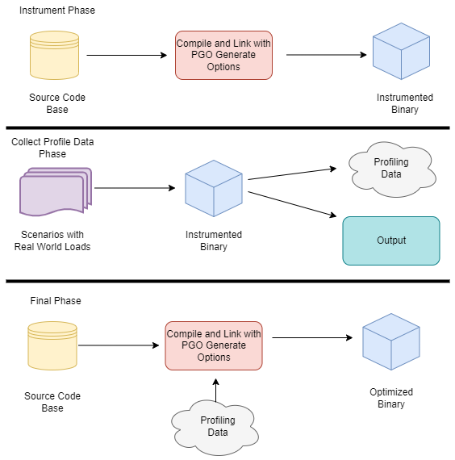

:title: Performance: CPU
:data-transition-duration: 950
:css: hovercraft.css

----

:data-x: r2500

.. class:: chapter

    CPU

The secrets of the computer 🧠

----

Agenda
======

* How to get from source to machine code?
* How does the CPU execute machine code?
* What performance effects does this have?
* Profiling & Benchmarking thoughts & tips

.. image:: images/cpu.jpg
   :width: 50%

-----

Quiz
====

1. If two CPUs have the same frequency, can we make assumptions on their speed?
2. If two programs *A* and *B* execute the same number of machine instructions will they have roughly the same runtime?

.. note::

   Those are the questions we will be looking into in detail today.
   Here's the TL;DR:

   1. Answer no.
      Every instruction can take a different amount of cpu cycles.
      Every instruction can do a lot of different work (SIMD vs normal)
   2. Also no.
      Speed of a CPU largely relies on many many factors (#core, cache size, ...)
      The frequency also did not increase much over the years since CPUs get
      manufactured much smaller, causing heat issues with higher freqs.

--------------

Compilers
=========

.. image:: diagrams/2_compilers.svg
   :width: 140%

.. note::

   Steps to compile something:

   * Lexer/Tokenizer (break code in tokens)
   * Parser (build AST from code)
   * High Level IR (build generic language from it)
   * Low level IR (optimize and make it suitable for machines)
   * Convert to actual target machine code

--------------

Fun fact: Supercompilers
========================

.. image:: images/supercompiler.png

.. note::

    * Compilers do not usually produce the best code and rely heavily on pattern matching, heuristics
      and just being smart. They can miss room for optimizations although this is rather rare in practice.
      (except Go, which is just a developing compiler)
    * Super compilers brute force compilation (sometimes with benchmarks) until they found the best performing
      piece of code.
    * Not used in practice, since freaking slow but helpful for developing new compiler optimizations.

    As you will see in the rest of the workshop,
    70% of optimization is to help the compiler
    make the right decisions.

    STOKE: https://github.com/StanfordPL/stoke

-----

How is code executed?
=====================

.. image:: diagrams/2_assembler.svg
   :width: 120%

.. note::

    * Assembly: 1:1 human readable interpretation of machine code.
    * Machine code: machine readable instructions (each instruction has an id)
    * Assembler: Program that converts assembly to machine code.

--------------

Other terminology
=================

* **ISA:** Instruction Set Architecture (``x86``, ``arm``, ...)
* **CISC** Complex Instruction Set Computer (``x86``)
* **RISC:** Reduced Instruction Set Computer (``arm``)
* **SIMD:** Single Instruction, Multiple Data
* **ISE:** Instruction Set Extensions (``AVX``, ``AES``, ``SSE``...)
* Micro{architecture,code} (``Pentium3``, ``Alder Lake``, ``Zen``...)

.. note::

    Example of a CISC instruction set: x86
    Today, most complex operations get translated to RISC code though by the CPU.
    CISC turned out to be slower, surprisingly.

    RISC: ARM. Usually cheaper to build and also faster.

    Microarchitecture: Implementation of a certain ISA.

    ISE (Instruction Set Extensions) are not directly available in Go, only if the compiler decides to use them.

--------------

How is machine code stored?
===========================

As ELF (Executable and Linkable Format)

.. code-block:: bash

    $ readelf --sections /usr/bin/ls
    [...]
    [12] .text             PROGBITS
    [...]
    [22] .data             PROGBITS
    $ objdump --disassemble /usr/bin/ls

.. note::

   Beside storing the actual instructions ELF solves:

   * Storing debugging info
   * Making it possible to link with existing other libraries.
   * Includes a text (code) and data section (pre-initialized variables)
   * Different OS use different formats, but ELF is probably the most relevant for you
     and also the most widely known. Windows has a different one.

--------------

Go Assembler #1
===============

.. code-block:: go
   :number-lines: 1

    package main

    //go:noinline
    func add(a, b int) int {
        return a + b
    }

    func main() {
        add(2, 3)
    }

.. note::

   The official Go compiler is not based on LLVM or GCC.
   However, it also uses a IR which it calls "Go assembler".
   It's basically an assembler like dialect for a fantasy CPU.
   After it was optimized, it gets translated to actual target machine code.

-----

Go Assembler #2
===============

.. code-block:: bash

  $ go build -gcflags="-S" add.go
  [...]
  main.add STEXT nosplit size=4 [...]
    (test.go:4) TEXT   main.add(SB), [...]
    (test.go:4) PCDATA $3, $1
    (test.go:5) ADDQ   BX, AX
    (test.go:5) RET
  [...]
  main.main STEXT size=121 [...]
  [...]
    (test.go:9) MOVL $2, AX
    (test.go:9) MOVL $3, BX
    (test.go:9) CALL main.add(SB)
    # result is in AX

https://go.dev/doc/asm

.. note::

    Important: There are many assembler dialects for many ISA. This is a IR.
    Also Important: Explain registers!

    Can we just say: To make things faster you have to reduce the number of instructions?

    Sadly no. Modern CPUs are MUCH complexer than machines that sequentially execute instructions.
    They take all kind of shortcuts to execute things faster - most of the time.
    See also: Megaherz myth (-> higher clock = more cycles per time)

    Effects that may play a role

    * Not every instruction takes the same amount of cycles (MOV 1 cycle,
    * Pipelining
    * Superscalar Execution
    * Branch prediction / Cache prefetching
    * Out-of-order execution
    * Cache misses (fetching from main memory)

    List of typical cycles per instructions ("latency"): https://www.agner.org/optimize/instruction_tables.pdf

----

Von-Neumann Architecture
========================

.. image:: images/vn_cpu.png
   :width: 100%

.. note::

    Von Neumann Computer: Memory contains data and code.
    CPU adresses memory as whole and can address I/O device the same way
    over a bus system.

    Greatly simplified.

    * Clocked with a certain frequency.
    * A cycle is the basic work synchronization.
    * Registers for internal usage. (CPUs have more than x86 says)
    * Peripherals look to the CPU like memory.

    Intel 8086 kinda worked this way.

----

Single instruction pipeline
===========================

.. image:: images/pipeline.png
   :width: 70%

1. **Load:** Instruction gets loaded (``0x012345``)
2. **Decode:** Check type/args of instruction.
3. **Memory:** Load data from memory (if necessary)
4. **Execute:** Calculate (e.g. add 2+3 in the ALU)
5. **Write back:** Save result in some register.

.. note::

    This would need 5 cycles per instruction.
    You kinda assumed, that one cycle is one instruction, did you?

----

Pipelining, OoO, Superscalar, wtf?
=====================================

* **Pipelining:** The 5 steps get done in parallel.
* **Out-of-Order:**  Instructions get re-ordered.
* **Superscalar:** Several instructions per cycle (~5x)

*Ergo:*

* 1 Cycle ≠ 1 instruction.
* CPU might do unnecessary work!
* Reducing instructions alone does not get us far.

.. note::

    * Every instruction needs to do all 5 steps
    * Modern CPUs can work on many instructions at the same time
    * They can be also re-ordered by the CPU! (think of a queue that gets reordered)
    * This can lead to issues when an instruction depends on results of another instructions! (branches!)
    * It can even happen that we do unncessary work!
      This made the SPECTRE and MELTDOWN security issues possible that made cloud computing 20% slower over night.
    * CPUs can also execute more than one instruction per cycle (e.g. one MOV, ADD, CMP, as they all use different parts of the CPU)
      (Superscalar CPUs)
    * This is the reason why focussing on reducing the number of instructions alone is not
      too helpful when optimizing.

    https://de.wikipedia.org/wiki/Pipeline_(Prozessor)

----

Disclaimer: CPU effects
=======================

* Modern CPUs are insanely complex (like humans).
* Compilers are insanely smart (unlike humans).
* This tandem is probably smarter than you and me.
  The following slides are mostly for educational purpose.
  Trust the compiler in 95% of the time.
* Still helpful to know what happens in the 5%.

----

Branch prediction
=================

.. code-block:: c

    // NOTE: works only in C/C++
    if(likely(a > 1)) {
        // ...
    }

    // Branch mis-prediction are very costly!
    // ~20 - ~35 cycles can be lost per miss.
    if(unlikely(err > 0)) {
        // ...
    }

.. note::

    Modern cpus guess what branch is taken due to pipelining. The accuracy is done to 96%,
    they even use neural networks for that.

    No likely() in Go, compiler tries to insert those hints automayically.
    Not much of an important optimization nowadays though as CPUs get a lot better:

    https://de.wikipedia.org/wiki/Sprungvorhersage

    (but can be relevant for very hot paths on cheap ARM cpus)

    Penalty Source: https://users.elis.ugent.be/~leeckhou/papers/ispass06-eyerman.pdf

----

Can we observe it?
==================

.. code-block:: go

    // Which loop runs faster?
    for(int i = 0; i < N; i++) {
        if (unsorted[i] < X) {
            sum += unsorted[i];
        }
    }
    for(int i = 0; i < N; i++) {
        if (sorted[i] < X) {
            sum += sorted[i];
        }
    }

.. class:: example

   Example: code/branchpredict

.. note::

   Effect is unnotice-able if optimizations are enabled.
   Why? Compilers can make the inner branch a branchless statement.

----

Profile Guided Optimization
===========================

.. note::

   Idea:

   * Let program run in analysis mode.
   * Capture data about what branches were hit how often.
   * Use this data on the next compile to decide which branch is likely!

   Feature is available as part of Go 1.20
   and since around 20 years as part of GCC/clang

   Also decides on where to inline functions.

   https://tip.golang.org/doc/pgo

   Old news for languages like C.

----

Branchless programming
======================

.. code-block:: c

    // Don't optimize this at home, kids.
    // Your compiler does this for you.
    uint32_t max(uint32_t a, uint32_t b) {
        if(a > b) {
            return a;
        }
        return b;
    }

.. code-block:: c

    // variant 1; not possible in Go:
    return (a > b) * a + !(a > b) * b;

    // variant 2; possible in Go:
    return a - (a - b)

.. note::

   Not relevant, as the compiler will optimize this for you in most cases
   by using branchless code.

   It can be however a life safer in hot loops if the compiler does not know.
   Always check the assembly output if unsure.

   https://gcc.godbolt.org/#%7B%22version%22%3A3%2C%22filterAsm%22%3A%7B%22labels%22%3Atrue%2C%22directives%22%3Atrue%2C%22commentOnly%22%3Atrue%2C%22intel%22%3Atrue%2C%22colouriseAsm%22%3Atrue%7D%2C%22compilers%22%3A%5B%7B%22source%22%3A%22%23include%20%3Calgorithm%3E%5Cnint%20max%28int%20x%2C%20int%20y%29%20%7B%5Cn%20%20return%20std%3A%3Amax%28x%2Cy%29%3B%5Cn%7D%5Cn%22%2C%22compiler%22%3A%22%2Fusr%2Fbin%2Fg%2B%2B-4.7%22%2C%22options%22%3A%22-O2%20-m32%20-march%3Dnative%22%7D%5D%7D

----

Loop unrolling and ILP
======================

*ILP* = Instruction Level Parallelism

.. code-block:: go

    // a loop is just a repeated if condition:
    for idx := 0; idx < 3; idx++ {
        sum += sin(idx)
    }

    // same, but no "idx < 3" needed:
    // (can be computed in parallel!)
    sum += sin(0)
    sum += sin(1)
    sum += sin(2)

.. note::

    * A for loop is just a repeated branch condition.
    * Compilers unroll simple loops.
    * If they don't hand unrolling can be useful (very seldom!)

    Example with interdependent code will not work as good:

    .. code-block:: go

        v := 1234
        for v > 0 {
            digit := v % 10
            v /= 10
        }

----

Just use less instructions?
============================

.. code-block:: c

    // How to reduce the number of instructions?
    char *memcpy_basic(char *dst, char *src, size_t n) {
        for(size_t i = 0; i < n; i++) {
            dst[i] = src[i];
        }
        return dst;
    }

.. class:: example

   Example: code/memcpy

.. note::

    -> Problem: von-Neumann-Bottleneck.
    -> CPU can work on data faster than typical RAM can deliver it.
    -> Workaround: Caches in the CPU, Prefetching.
    -> Actual solution: Data oriented design.
    -> Sequential access, tight packing of data, SIMD (and if you're crazy: DMA)
    -> Still best way to speed up copies: don't copy.

    Object oriented design tends to fuck this up and many Games (at their core)
    do not use OOP. You can use both at the same time though!

----

SIMD
====

.. image:: images/simd.png
   :width: 100%

https://github.com/mmcloughlin/avo

.. note::

   SISD = Single Instruction / Single Data
   SIMD = Single Instruction / Multiple Data

   Can be really worth the effort, since compilers can't figure out
   all cases where SIMD can be used.

   Example use cases:

   * Image computation (i.e. changing brightness of several pixels at once)
   * Math operations like vector / matrix multiplications.
   * Audio/DSP processing.

   Disadvantage: Code gets ugly, hard to maintain and has additional obstacles
   to solve like memory alignment. Also freaking complicated, which is why
   we won't go into detail. Read up more here if you really want to:

   https://en.wikipedia.org/wiki/Single_instruction,_multiple_data

----

Optimization: Inlining
======================

.. image:: diagrams/2_inlining.svg
   :width: 130%

.. note::

    Inlining functions can speed up things at the cost of increased ELF size.

    Advantage: Parameters do not need to get copied, but CPU can re-use whatever
    is in the registers alreadys. Also return values do not need to be copied.

    Only done for small functions and only in hot paths.

--------------

I like to MOV, MOV it
=====================

.. code-block:: asm

  # General syntax:
  # MOV <dst>,<src>

  # Possible:
  MOV reg1, 1234
  MOV reg1, reg2
  MOV reg1, [1234]
  MOV [1234], reg1
  MOV [reg2], reg1

  # Not possible:
  MOV [1234], [4321]

.. note::

    How does access to main memory work? By using the MOV instruction.
    And MOV from main memory is very costly:
    Access to main memory is 125ns, L1 cache is ~1ns

    Fun fact: MOV alone is Turing complete: https://github.com/xoreaxeaxeax/movfuscator

    TODO: Move this slide a bit before cache lines?

--------------

von Neumann Bottleneck
==========================

.. image:: diagrams/2_bottleneck.svg
   :width: 100%

.. note::

    von Neumann Architektur:

    * Computer Architecture where there is common memory accessible by all cores
    * Memory contains Data as well as code instructions
    * All data/code goes over a common bus
    * Pretty much all computer nowadays are build this way

    Bottleneck: Memory acess is much slower than CPUs can process the data.

----

Just add some caches!
=====================

.. image:: images/whatcouldgowrong.jpeg

.. note::

   Good example of our industry really.

   Instead of fixing an issue we wrap layers aorund it
   until we just don't see the problem. But we never fix it.

----

L1, L2, L3
==========

.. image:: images/l1l2l3.png
   :width: 70%

----

Cache lines (64B)
=================

.. image:: diagrams/2_cache_line.svg
   :width: 100%

.. note::

    Minimal line size is 64 byte!
    It can only be written and evicted as one.
    No partial reads or writes possible.

    (Reason: adress space would be too big otherwise)

----

Caches misses
=============

.. class:: example

   Example: code/counter (1-3)

.. code-block:: bash

   # Use this to check your cache miss count:
   $ perf stat -p <PID>

.. note::

    https://access.redhat.com/documentation/en-us/red_hat_enterprise_linux/8/html/monitoring_and_managing_system_status_and_performance/getting-started-with-perf_monitoring-and-managing-system-status-and-performance
    https://access.redhat.com/documentation/en-us/red_hat_enterprise_linux/8/html/monitoring_and_managing_system_status_and_performance/overview-of-performance-monitoring-options_monitoring-and-managing-system-status-and-performance

----

(Struct) size matters!
======================

.. code-block:: go

    // Quiz: How big is this struct?
    type XXX struct {
        A int64
        B uint32
        C byte
        D bool
        E string
        F []byte
        G map[string]int64
        H interface{}
        I int
    }

----

What's padding?
===============

.. code-block:: go

    x := XXX{}         // measured with Go 1.20!
    s := unsafe.Sizeof //
    println(s(x.A))    // 8 int64
    println(s(x.B))    // 4 uint32
    println(s(x.C))    // 1 byte
    println(s(x.D))    // 1 bool
                       // +2 padding
    println(s(x.E))    // 16 string (ptr+len)
    println(s(x.F))    // 24 slice (ptr+len+cap)
    println(s(x.G))    // 8 map (ptr)
    println(s(x.H))    // 16 iface (ptr+typ)
    println(s(x.I))    // 8 int
                       // Sum: 86
    println(s(x))      // 88 (not 86!)

.. note::

    If a struct is bigger than a cache line, then accessing .A and .I
    would cause the CPU to always require to get a new cache line!

    Keep your structures under 64 bytes at max. Even less is better,
    aim to stay under 32 byte.

    Some more background info regarding why the value needs to be padded
    can be found here (i.e. instructions require proper alignment):

    https://go101.org/article/memory-layout.html

----

.. code-block:: go

    var data [100]XXX
    for _, elem := range data {
        // 100 cache misses (at least)!
        fmt.Println(elem.A, elem.I)
    }

.. code-block:: bash

    # How big is a cache line?
    $ lscpu --caches

.. note::

    Good article with a slightly different (and more realworld) example:

    https://www.ardanlabs.com/blog/2023/07/getting-friendly-with-cpu-caches.html

----

(Binary) size matters!
=======================

* More debug symbols, functions, lookup tables and instructions make the binary bigger.
* A process needs *at least* as much memory as the binary size (*Caveat:* only the first one)
* The bigger the binary, the longer the startup time. Important for shortlived processes/bootup (scripts!)
* CPUs have separate caches for code instructions. If your program is so fat that that the caches get evicted while jumping
  between two functions, then you pay with performance.

.. class:: small

    »*Yo binary is so fat, you see it on Google Earth!* 🌍«

.. note::

   Binaries can be compressed with UPX, but that does make start up time faster - contrary to that.

   Also, in the embedded world the binary size is way more important, but 30M binaries seem excessive
   even on servers. Go is doing a bad job here while Rust produces tiny outputs.

----

Binary sizes per language
=========================

(for a »*Hello world!*«)

.. image:: images/binary_sizes.png
   :width: 100%

.. note::

   Source: https://drewdevault.com/2020/01/04/Slow.html

----

Detour: `perf` command
======================

.. code-block:: bash

    # Like `time` but much better.
    $ perf stat -a <command>
    $ perf stat -a -p <PID>

    # See where the system spends time now:
    $ perf top

    # Detailed report about memory access / misses
    $ perf mem record -a ./counter atomic
    $ perf mem -t load report --sort=mem

    # Can find false sharing (see next chapter)
    $ perf c2c

----

Detour: ``pprof``
-----------------

.. image:: images/dashboard_pprof_preview.png
   :width: 100%

.. code-block:: go

    import _ "net/http/pprof"
    go http.ListenAndServe("localhost:3000", nil)

.. code-block:: bash

    $ go tool pprof localhost:3000/debug/pprof/profile
    $ go tool pprof localhost:3000/debug/pprof/heap

.. note::

   Look at images/dashboard_pprof.svg here.

   Pprof is also available for Python, but not as well integrated:
   https://github.com/timpalpant/pypprof

----

Detour: Flame graphs
====================

.. image:: images/brig_flamegraph.png
    :width: 80%

.. code-block:: go

    f, _ := os.Create("/tmp/cpu.pprof")
    pprof.StartCPUProfile(f)
    defer pprof.StopCPUProfile()

.. code-block:: bash

    $ go tool pprof -http=":8000" <binary> /tmp/cpu.prof

.. note::

    Alternative for short lived programs:
    make pprof record a profile.

    See images/brig_flamegraph.png
    See images/brig_flamegraph.html

    Perfect to see what time is spend in in what symbol.
    Available for:

    * CPU
    * Memory Allocations (although I like pprof more here)
    * Off-CPU (i.e. I/O)

----

False sharing
=============

* **Problem:** Unrelated data in the same cache line gets modified and thus cache line gets evicted.
* **Solution:** Add some padding!

.. class:: example

   Example code/counter (4)

.. note::

    If a program modifies data, the responding cache line needs
    to be evicted (unless the modification resulted from the currently
    running program). This is called "cache eviction" in short.

    If it happens because the data in the cache line was actually
    changed, then all is good. Data needs to be fetched again from memory
    which costs a bit of time.

    But what if two data points just happen to be in the same cache line?
    Imagine two int64 counters that get incremented by two separate threads.
    They do not talk to each other and should be influenced by each other.
    However, each increment evicts the cache line and causes a slowdown.
    We can use padding to force each counter into a separate cache line.

----

True sharing
============

* **Situation:** Closely related data lands in the same cache line.
* **Effect:** Less jumping, less memory loads, higher throughput.
* **Trick:** Structs < 64 byte and being cache friendly.

.. class:: example

   Example: code/striding

.. note::

    This is when the idea of introducing caches between CPU and memory works out.
    Good news: Can be controlled by:

    * Limiting struct sizes to 64 bytes
    * Grouping often accessed data together.
      (arrays of data, not array of structs of data)

    A bad example of this are linked lists. The next node is usually somewhere else
    in memory and the size of a single node is below 64 bytes. This results in cache lines
    that are mostly loaded for no reason. One solution would be to design cache-friendly linked
    list by packing more data into the node itself.

----

Typical Access patterns
=======================

.. image:: images/access_patterns.png
   :width: 100%

|

.. note::

    *Learning:* Group data in a CPU friendly way. Prefer *Struct of Arrays* over
    *Array of Structs* if you require a performance boost.

----

AoS vs SoA
==========

.. code-block:: go

    var AoS []struct{ // ArrayOfStructures
        A int
        B int
    }

    var SoA struct{   // StructureOfArrays
        A []int
        B []int
    }

.. image:: images/struct_of_slices.png
    :width: 90%

----

Dataoriented programming
=========================

The science of designing programs in a CPU friendly way.

.. image:: images/dop_book.png
   :width: 50%

.. note::

   DOP is often mentioned as contrast to OOP, but both concepts can complement each other.

   Object oriented program is designing the program in a way that is friendly to humans.

   It does by encapsulating data and methods together. By coincidence, this is not exactly
   helpful to the machine your program runs on. Why?

   - global state (i.e. impure functions) make branch/cache predictions way harder.
   - hurts cache locality.

-----

Quiz: Matrix Traversal
======================

.. code-block:: c

    int *m = malloc(N_ROWS * N_COLS * sizeof(int));

.. image:: images/matrix_traversal.png
   :width: 100%

.. class:: example

    Example: code/matrix

.. note::

    What is faster? Traversing ``m``...

    1. ...row by row?
    2. ...column by column?

    Good picture source: https://medium.com/mirum-budapest/introduction-to-data-oriented-programming-85b51b99572d

----

Recursion vs Iteration
======================

* Recursion is elegant but can be expensive.
* Make the recursive call the last thing in your function.
* (»Tailcall optimization«)

.. code-block::

    BenchmarkSum/normal    286.7 ns/op
    BenchmarkSum/tailcall  242.1 ns/op
    BenchmarkSum/iterative  71.1 ns/op

.. class:: example

    Example: code/tailcall

.. note::

    Recursive algorithms like quicksort or merge sort are relatively elegant
    when writing as recursive function. Sadly, this results in some performance impact.

    Why? Because function call have a certain overhead, as we will see in the next chapter.
    This function overhead can be reduced if we place the recursive function call at the end
    of the function. This allows a smart compiler to save some instructions. An even smarter
    compiler (clang or gcc) might even able to convert the recursion function into its
    iterative equivalent.

    This is called "Tail call optimization": https://de.wikipedia.org/wiki/Endrekursion

----

Virtual funcs & Interfaces
============================

.. image:: images/interface.svg
   :width: 60%

.. class:: example

   Example: code/cost_of_interface

.. note::

   Interface calls have between 2x to 10x as much overhead as direct calls in Go.

   Interfaces also have a space cost. A variable of type interface is basically
   a pointer with 16 byte (Space!). It consists of two actual pointers: type
   (pointing to a struct describing the type for reflection) and a pointer to
   the actual data the interface points to. This is one indirection more, one
   more cycle for the GC.

   Also, interfaces are opaque to the compiler. It cannot reason about what
   they could do, so they can not use inlining or do proper escape analysis and
   instead allocate on the heap always.

   More info: https://syslog.ravelin.com/go-interfaces-but-at-what-cost-961e0f58a07b

   Now you could say: Ah, I don't use Go, all good. Well, pretty much all
   languages that support OOP are affected by this kind of behaviour. Virtual
   methods in C++ or Java have their price too: They need to lookup a vtable,
   which adds some more instructions but most importantly hinders the compiler
   to optimize further.

   Since especially Java uses Getters and Setters a lot - which are just one-line
   functions in most cases - they pay quite a penalty regarding performance.

   Python is especially wild, since they just might do tons of dictionary lookups
   if you use classes with a lot of inheritance.

----

Boundcheck Elimination
===========================

Help the compiler!

.. class:: example

   Example: code/boundscheck

.. note::

    In a memory-safe language all access to slices are checked
    (and if out-of-bound, an language panic/exception is produced)

    This is a very small price to pay for the safety, but it costs
    a few instructions.

    More infos can be found here:
    https://go101.org/article/bounds-check-elimination.html

----

Process scheduler
=================

**Context switch:**

* *Before execution:* Load register state from RAM.
* *After execution:* Store register state in RAM.

.. image:: images/process_states.webp
   :width: 50%

.. note::

    We're not alone on a system. Every process get assigned a share of time that it may execute.

    -> Expensive. Switching too often is expensive.

    * scheduler types (O(n), O(1), CFS, BFS)
    * scheduler is determined at compile time.
    * there are some knobs to tune the scheduler, but not that interesting.
    * Show process states with `ps a`.

----

Process load
============

**Load:** Count of processes currently in running or waiting state.

:math:`load_{now} = \begin{cases}N_{count} = 0\:\:\:\:\:\:\:\:\:\iff\textrm{Idle}\\N_{count} < N_{cores}\iff\textrm{Normal}\\N_{count}\ge N_{cores}\iff\textrm{Overload}\end{cases}`

.. note::

   The load metric makes most sense if averaged over some time.

   Those are the load5/load10/load15 params.
   Use load5 for graphs, load15 for quick judgmenet.

   You can use the "uptime" command to check the load.

----

Process niceness
================

*Niceness* is the scheduling priority.

* Ranges from :math:`-20` to :math:`+19`; :math:`0` is default.
* :math:`-20` gives the process more time to execute.
* :math:`+19` gives the process way less to execute.

.. code-block:: bash

   # for new processes: sleep with high prio
   $ nice -n -20 sleep 5s

   # for running processes: change to unimportant
   $ renice -n +19 $(pgrep docker)

.. note::

    Disclaimer: Exact behaviour depends on scheduler (scheduling frequency vs
    time slice size)

----

Rough Rules to take away
========================

1. Watch out for cache misses.
2. Keep your structs small (< 64B).
3. Check if you need padding (false sharing).
4. Place often accessed data close (true sharing).
5. Design your access patterns cache friendly.
6. Avoid virtual methods and inheritance.
7. Do not overuse pointers over values.
8. Trust your compiler, but check what it did.
9. Use SIMD if you have to; or leave it to others.

.. note::

   Go even warns about too structures (if they are used as values):
   gocritic hugeParam: cfg is heavy (240 bytes); consider passing it by pointer

   A good and very quick summary is also in this article
   (although you need background info to understand the tips):

   https://medium.com/scum-gazeta/golang-simple-optimization-notes-70bc64673980

----

Fynn!
=====

|

.. class:: big-text

    🏁

|

.. class:: next-link

    **Next:** `Memory <../3_memory/index.html>`_: Bookkeeping is hard 📝
