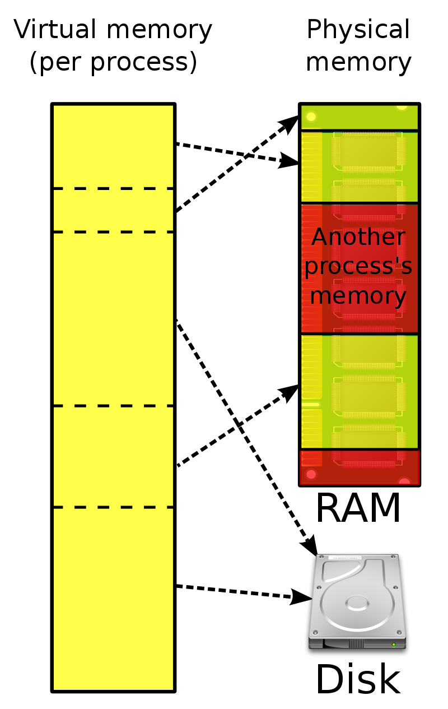

----

Memory
======

----

RAM
===

* **RAM** = Random Access Memory
* Huge, sequential line of individual memory cells
* Usually can only be addressed in pages
* Memory controller that handles the actual interaction.
* Two major types: Static RAM (SRAM) vs Dynamic RAM (DRAM)

.. note::

   SDRAM = Synchronous DRAM
   DDR-SDRAM = Double Data Rate SDRAM

----

DRAM - one bit, please
======================

.. image:: images/dram.png
   :width: 100%
   :align: center

.. note::

   Dynamic sounds good, doesn't it?

   * Very simple and cheap to produce.
   * High density (many cells per area)
   * Needs to be refreshed constantly (64ns or so)

----

SRAM - one bit, please
======================

.. image:: images/sram.png
   :width: 100%
   :align: center

.. note::

   * Very fast. 10x speed of DRAM
   * No refresh required.
   * Low power consumption
   * Expensive, not so high density

----

Why use DRAM at all?
====================

* Because it's cheap,  and we need tons of it.
* Main memory is all DRAM.
* Caches (L1-L3) are SRAM.
* A lightbulb is maybe OSRAM (Sorry.)

.. note::

   So basically...

   again, hardware is at fault
   and instead of fixing it with some Pfiffikus
   we software devs have to cope with slow main memory.

----

NUMA
====

Is the access to all memory offsets equally fast?

* Not if you have more than one CPU!
* Every CPU gets 1/nth of the memory.
* Every CPU can access the completely memory.
* Non-local access is costly.

.. note::

   NUMA - non uniform memory access

   Linux is NUMA very well capable and that's why it's such a popular server operating system.
   Or one of the reasons at least.

----

How the heck does this stuff relate to me?
==========================================

Not so much on a daily basis, to be fair. But:

* Memory allocations are expensive.
* Strategies to make less/smaller allocations help performance
* Requires sadly an understanding how the OS handles memory.

----

TODO: Maybe use graphics from here: https://medium.com/eureka-engineering/understanding-allocations-in-go-stack-heap-memory-9a2631b5035d

The stack & heap #1
===================

.. code-block:: go

    //go:noinline
    func f() *int {
        v := 3
        return &v
    }

    func main() {
        // Two for the stack:
        // a=0xc00009aef8 b=0xc00009aef0
        a, b := 23, 42

        // Two for the heap:
        // c=0xc0000b2000 d=0xc0000b2008
        c, d := f(), f()
    }

----

The stack & heap #2
===================

**Stack** is...

* ...can be reasoned about during compile time
* ...cleaned up automatically on return
* ...bound to a function call
* ...preferred if possible.

**Heap** is...

* ...needs to be explicitly requested
* ...needs to be explititly cleaned up
* ...can be used until freed.
* ...should be used when required.

----

The stack & heap #3
===================

Go is clever and hides this from you via
**escape analysis**:

.. code-block:: go

   func f() { v := 3; return &v }
   func main() {
       fmt.Println(f())
   }

.. code-block:: bash

   $ go build -gcflags="-m" .
   ./main.go:3:2: moved to heap: v

The more you allocate on the heap, the more pressure you put on the
memory bookkeeping and the garbage collector.

**Performance tip:** Avoid variables escaping to the heap:

*
* Avoid using pointers if unnecessary
* Prefer return by value if value is small (< 128 byte) (small copy is faster than GC)
* Don't overreact here though. Don't make your APIs ugly just because you know this little fact. Use this in hot loops. AFTER measurement.

.. note::

   Never heard of this stuff, why should I care?

   Difference is important in C
   Well, you're lucky enough that your compiler does it for you
   Or you're unlucky enough to use python where all hope is forlorn

----

GC pressure, locality and memory management
===========================================

Prefer this:

.. code-block:: go

   m := make(map[string]someStruct)

over:

.. code-block:: go

   m := make(map[string]*someStruct)

* Way less memory in total
* Data is packed together (good for caching!)
* Less work for the GC and the allocator to do
* Pointers give you more potential to fuck up.

.. code-block:: bash

    noptr  577.7 ns/op	 336 B/op	      2 allocs/op
    ptr    761.4 ns/op	 384 B/op	     10 allocs/op

    (The 10 will increase with input! Longer runs will cause more GC for the ptr case)

----

Virtual memory
==============

* The physical memory of a system is splitted up into 4k pages.
* Each process maintains a virtual memory mapping table, mapping
  from the virtual range of memory to physical memory.
* Address translation is handled efficiently by the MMU

.. note::

    Wait, those addresses I saw earlier... are those the addrs in RAM?
    Hopefully not, because otherwise you could somehow find out where the OpenSSH
    server lives in memory and steal it's keys. For security reasons it must look
    for each process like he's completely alone on the system. What you saw above
    are virtual memory addresses and they stay very similar on each run.

    The concept how this achieved is called "virtual memory" and it's probably one of
    the more clever things we did in computer science.

----

Virtual memory advantages
=========================

* Pages can be mapped only once it is needed (CoW)
* Processes can share the same page for shared memory.
* Pages do not need to be mapped to physical memory: Disk, DMA or even network is possible!
* Processes are isolated from each other.
* Processes consume only as much physical ("residual") memory as really needed.
* Programs get easier because they can just assume that the memory is not fragmented.
* Pages can be swaped by the OS without the process even noticing (Swapping)

----

Virtual memory implementation
=============================

* Each process has a list of page tables mapping virtual to physical memory ("page table")
* On process start this table is filled with a few default kilobytes of mapped pages
  (the first few pages are not mapped, so dereferencing a NULL pointer will always crash)
* When the program first accesses those addresses the CPU will generate a page fault, indicating
  that there is no such mapping. The OS receives this and will find a free physical page, map
  it and retry execution. If another page fault occurs the OS will kill the process with SIGSEGV.

----

malloc()
========

* Virtual memory
  -> SIGSEGV when accessing virtual memory that is not mapped ("page fault").
  -> Page cache
  -> Page stealing: seldomly used pages go to swap and only read back on use.

* Page faults
* Residual vs shared memory
* sbrk()
* What happes on malloc?
* Swap
* Low memory situations (OOM)
* Stack vs Heap
* Dynamic memory allocation
* Measuring allocations in Go

----
