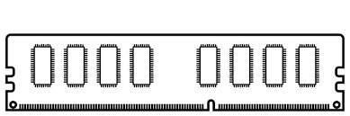
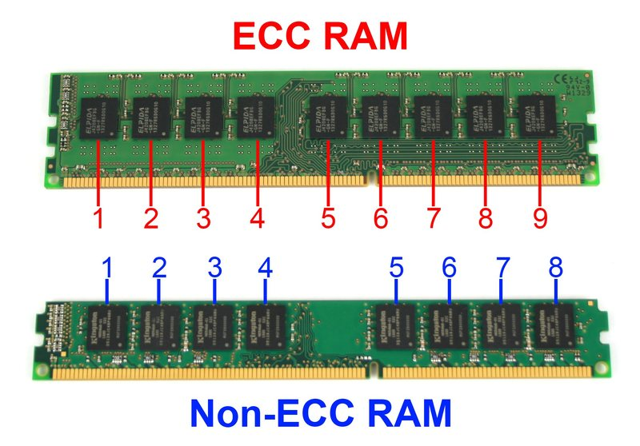

:title: Performance: Memory
:data-transition-duration: 1500
:css: hovercraft.css

Agenda
======

* How does memory work as hardware?
* How does Linux manage memory?
* How can we measure & profile memory usage?
* How can we allocate less and faser?

----

RAMa Lama Ding Dong 🎺
======================

* **RAM** = Random Access Memory
* Huge, sequential line of individual memory cells.
* Usually can only be addressed in 4K pages.
* Memory controller that handles the actual interaction between Bus and CPU.

Two major types in use today:

* *Static RAM* (SRAM)
* *Dynamic RAM* (DRAM)

.. note::

   SDRAM = Synchronous DRAM
   DDR-SDRAM = Double Data Rate SDRAM

----

DRAM - one bit, please
======================

.. image:: images/dram.png
   :width: 100%
   :align: center

.. note::

   Dynamic sounds good, doesn't it? Well, it isn't...

   Pros:

   * Very simple and cheap to produce.
   * High density (many cells per area)

   Cons:

   * Needs to be refreshed constantly (64ns or so)
   * Makes logic in controller way more complicated.
   * Relatively slow.
   * Enables security issues like ROWHAMMER.

----

SRAM - one bit, please
======================

.. image:: images/sram.png
   :width: 100%
   :align: center

.. note::

   * Very fast. 10x speed of DRAM
   * No refresh required.
   * Low power consumption
   * Expensive, not so high density

----

Why use DRAM at all?
====================

* Because it's cheap, and we need tons of it.
* Main memory is all DRAM.
* Caches (L1-L3) are SRAM.
* A lightbulb is maybe OSRAM (Sorry.) 💡

.. note::

   So basically...

   again, hardware is at fault
   and instead of fixing it with some Pfiffikus
   we software devs have to cope with slow main memory.

----

ROWHAMMER 🔨
============

.. image:: images/rowhamer.webp
   :width: 100%

.. note::

   Fun fact: DRAM enables a hardware-based security attack: ROWHAMMER.
   Changing a row of DRAM cells can, if done very often, switch a
   nearby row. This can be used to change data like "userIsLoggedIn".

----

ECC Memory
==========

* Radiation or damage can flip bits
* ECC RAM protects against such errors.
* Use of parity bits or Hamming code.
* Slightly slower than normal RAM.

----

NUMA - multiple CPUs
====================

NUMA = Non Uniform Memory Architecture

Is the access to all memory offsets equally fast?

* Not if you have more than one CPU!
* Every CPU gets 1/nth of the memory.
* Every CPU can access the complete memory.
* Non-local access is costly.

.. note::

   TODO: is that slide really important? If yes, make it prettier using a diagram.

   Linux is NUMA capable and that's why it's such a popular server and
   superomputer operating system. Or one of the reasons at least.

----

How is memory managed?
======================

.. image:: diagrams/3_os_allocations.svg
   :width: 100%

.. note::

    The large sequential slab of memory needs to be
    distributed to all programs that require it.

    - Usage is not known in advance.
    - programs need to allocate based on their need.
    - OS needs to make memory allocations inexpensive

    Understandin how the kernel and processes manage their memory
    makes it possible to use less of it and make more efficient use of it.

    For this we need to start at the basics...

----

Inside a process
================

* Each process may allocate certain amounts of memory on-demand.
* Memory inside the process can be managed in two ways: *Stack* and *Heap.*
* *Stack:* For short-lived memory.
* *Heap:* For long-lived memory.

----

The stack: LIFO Layout
======================

.. image:: images/stack_layout.svg
    :width: 80%

.. note::

   https://en.wikipedia.org/wiki/Stack-based_memory_allocation

----

The stack: Growth
=================

.. code-block:: go

    func recursive(depth int) {
        if depth <= 0 { return }

        var a int
        fmt.Printf("%p\n", &a)
        recursive(depth - 1)
    }
    // ...
    recursive(10)

    // Output:
    0xc000070e70 -> diff: 80 bytes due to:
    0xc000070e20 -> stack pointer, frame pointer
    0xc000070dd0 -> registers, params, ...
    ...

.. note::

    Stack grows downwards.

    More details on calling a function:

    https://eli.thegreenplace.net/2011/09/06/stack-frame-layout-on-x86-64

----

The stack: Overflow
===================

Why not use the Stack for everything?

1. Stack size is limited to 8MB (default on Linux).
2. Memory is bound to your call hierarchy.
3. Stack is per-thread, sharing requires heap.

.. note::

    1: Reason for this are security mostly. Recursion happens on the stack, so
       endless recursive programs cannot break everything. Also running over the
       extents of a buffer in C (Security issue!) will overwrite parts of the
       stack, so limiting it makes sense.

    2. Stack is a LIFO. You cannot free objects down in the stack without
       freeing everything in between.

    3. Every thread (and in Go every goroutine) has their own stack.

.. class:: example

   Example: code/stackoverflow

----

The stack: Summary
==================

* ...cleaned up automatically on return.
* ...bound to a function call.
* ...low overhead and should be preferred.
* ...can be reasoned about during compile time.
* ...good for small amounts of data.

----

The Heap: Allocations
=====================

.. code-block:: go

    //go:noinline
    func f() *int {
        v := 3
        return &v
    }

    func main() {
        // Two for the stack:
        // a=0xc00009aef8 b=0xc00009aef0
        a, b := 23, 42

        // Two for the heap:
        // c=0xc0000b2000 d=0xc0000b2008
        c, d := f(), f()
    }

.. note::

   Contrary to the stack, the memory is not bound to the function
   and therefore will survive the return of a function. The downside
   is that the memory needs to be freed

   Languages like Go allocate automatically on the heap if they
   have to - they do this either when the compiler cannot prove that
   the value does not escape the function stack or when the allocation
   is too big for the stack. More on this later. Thanks to the GC
   memory is freed automatically after it's used. Having a GC is often
   understood as "I don't need to think about memory" though, which is not
   the case. You can help the GC to run faster and avoid memory leaks
   that can arise through edge cases.

   Languages like Python allocate everything on the heap. They almost
   never use stack based memory for anything. Most interpreted languages
   use a combination of reference counting and garbage collection.
   Very convenient but also the slowest way to go.

   Languages like C (and partly Rust) pass the duty of memory management
   to the programmer. While this make it possible to be clever, it also
   opens up ways to fuck up tremendously by creating memory leaks, double
   frees, forgotten allocations or use-after-free scenarios.

   Heap memory must be cleaned up after use. Go does this with a GC.

   Heap grows upwards.

   TODO: Maybe use graphics from here: https://medium.com/eureka-engineering/understanding-allocations-in-go-stack-heap-memory-9a2631b5035d

----

The Heap: ``malloc()``
======================

.. code-block:: c

    int *ptrs[100];
    for(int i = 0; i < 100; i++) {
        ptrs[i] = malloc(i * sizeof(int));
    }
    // ... use memory ...
    for(int i = 0; i < 100; i++) {
        free(ptrs[i]);
    }

.. note::

   malloc() is a function that returns N bytes of memory, if available.
   It is a syscall of the kernel, but implemented as library in userspace.

   malloc() manages internally a pool of memory internally, from which it
   slices of the requested portions. Whenever the pool runs out of fresh
   memory, the malloc implementation will ask the kernel for a new chunk
   of memory. The exact mechanism is either over sbrk(2) or mmap()
   (we will see mmap later)

   As malloc() needs to cater objects of many different sizes (as seen in the
   example above) it is prone to fragmentation.

----

The Heap: Freelist
==================

.. image:: images/heap_freelist.png
   :width: 70%

.. note::

   As mentioned above, the memory allocated from the pool
   needs to be freed, so it can be re-used. This is done by the free() call.

   malloc() needs to track which parts of its pool are in-use and which can
   be issued on the next call. It does by the use of free-lists. Each block
   returned by malloc() has a small header (violet) that points to the next block.
   The memory returned by malloc() is just behind this small header.

   Once allocated, a free block is taken out of the list and added to the "allocated"
   list. This means that every allocation has a small space and time overhead.

   On free(), the opposite happens: The block is put back into the freelist
   and out of the "allocated" list.

   (i.e. an allocation is O(log n), instead of O(1) as with the stack)

   Useful Links:

   * https://azeria-labs.com/heap-exploitation-part-1-understanding-the-glibc-heap-implementation (More details)
   * https://sourceware.org/git/?p=glibc.git;a=blob;f=malloc/malloc.c;h=05e65a2d54f9b3850fa0c4d2c7dfaae3dfd94dac;hb=HEAD#l54
   * https://sourceware.org/git/?p=glibc.git;a=blob;f=malloc/malloc.c;h=05e65a2d54f9b3850fa0c4d2c7dfaae3dfd94dac;hb=HEAD#l102:

----

The Heap: Leaks
===============

.. code-block:: c

    // In C:
    char *s;
    s = malloc(20);
    s = malloc(30); // leak: 20 bytes.

.. code-block:: go

    // In Go:
    var m map[string][]byte{}
    func f(v int) {
        // the slice will be still referenced after
        // the function returned, if not delete()'d
        m["blub"] = make([]byte, 100)
        return v * v
    }

.. note::

    Other sources of memory leaks:

    - Go routines blocking forever.
    - Assigning a small slice of a big array to a variable
      (causing the whole array to be still referenced)

    Use pprof to find memory leaks in Go.

    In C it's very easy to forget a free(), therefore quite
    some impressive tooling developed over the years. The most prominent
    example is valgrind: https://valgrind.org

    Python: Also has memory leaks, finding them is much harder
    since the tooling is not great (at least when I looked last time).
    Also: Memory leaks can happen on the C-side or in the python code
    itself. If they happen in a C-module you're pretty much fuc.. lost.

----

The Heap: Summary
=================

**Heap**

* ...needs to be explicitly requested.
* ...needs to be explititly cleaned up.
* ...can be used until freed. Will crash otherwise.
* ...required for big data chunks or long-lived data.
* ...has a small, but noticeable, overhead.

.. note::

   Heap requires some implementation of malloc(). There are many different implementations
   of it in C, using different strategies to perform well under certain load.
   Choosing the right kind of allocator is a science in itself. More info can be obtained here:

   https://en.wikipedia.org/wiki/Memory_management#Implementations

   In languages like Go you don't have a choice which memory allocator you get. The Go runtime
   provides one for you. This makes sense as it is coupled very tightly with the garbage collector.
   Go uses a similar implementation, but is more sophisticated. Main difference:
   it keeps pre-allocated arenas for differently sized objects. i.e. 4, 8, 16,
   32, 64 and so on.

   The grow direction of the heap and stack is not really important and you
   should keep in mind that every thread/goroutine has their own stack and
   there might be even more than one heap area, possibly backed by different
   malloc() implementations.

----

Garbage collector (GC)
======================

.. image:: images/gc.png
   :width: 100%

.. note::

    GC is a utility that remembers allocation and scans the memory used by the program
    for referenes to the allocations. If no references are found it automatically cleans
    up the associated memory.

    This is very ergonomic for the programmer, but comes with a peformance impact. The
    GC needs to run regularly and has, at least for a very small amount of time, stop
    the execution of the program.

    Good reference for the Go GC: https://tip.golang.org/doc/gc-guide

----

GC: Pressure
=============

.. code-block:: go

   // Prefer this...
   m := make(map[string]someStruct)

   // ...over this:
   m := make(map[string]*someStruct)

.. class:: example

   Example: code/allocs

.. code-block:: bash

    # counting words with a map:
    $ go test -v -bench=. -benchmem
    noptr  577.7 ns/op	 336 B/op   2 allocs/op
    ptr    761.4 ns/op	 384 B/op  10 allocs/op

.. note::

    "GC Pressure" describes the amount of load a garbage collector currently has.
    The more small objects it has to track, the higher the load. You can help it
    by reducing the amount of different objects and making use of sync.Pools (see later)

    One way to less use memory is to use less pointers:

    * Way less memory in total (one cell less for the pointer)
    * Data is packed together (good for the CPU cache!)
    * Less work for the GC and the allocator to do
    * Pointers give you more potential to fuck up (they can be nil...)

    The "10" will increase with input size!
    Longer runs will cause more GC for the ptr case.

----

GC: Escape Analysis
===================

.. image:: images/escape_analysis.jpg
   :width: 100%

.. code-block:: bash

   $ go build -gcflags="-m" .
   ./main.go:5:2: moved to heap: x

.. note::

    Only heap allocated data is managed by the garbage collector.
    The more you allocate on the heap, the more pressure you put on the
    memory bookkeeping and the garbage collector.

    * Avoid using pointers and refactor to make it allocate-able on the stack.
    * Prefer pass & return by value if value is small (< 64 byte ~= cache line)
    * Use sync.Pool to save allocations.

    Good guide for the details: https://tip.golang.org/doc/gc-guide#Eliminating_heap_allocations

    Picture source: https://dev.to/karankumarshreds/memory-allocations-in-go-1bpa

----

GC: Pre-Allocate
================

.. code-block:: go

    s := make([]int, 0, len(input))
    m := make(map[string]int, 20)
    // ...

    // If you need to concatenate many strings:
    var b strings.Builder
    b.Grow(100 * 13)
    for idx := 0; idx < 100; idx++ {
        b.WriteString("Hello World!\n")
    }
    fmt.Println(b.String())

.. class:: example

   Example: code/prealloc

----

GC: Pooling
===========

.. code-block:: go

    // avoid expensive allocations by pooling:
    var writerGzipPool = sync.Pool{
        // other good candidates: bytes.Buffer{},
        // big slices, empty objects used for unmarshal
        New: func() any {
            return gzip.NewWriter(ioutil.Discard)
        },
    }

    w := writerGzipPool.Get().(*gzip.Writer)
    // ... use w ...
    writerGzipPool.Put(w)

.. class:: example

   Example: code/mempool

.. note::

    Pooling is the general technique of keeping a set of objects that are expensive object,
    if they can be re-used. Typical examples would be thread pools that keep running threads
    around, instead of firing up a new one for every task. Same can be done for memory objects
    that are expensive to allocate (or have long-running init code like gzip.Writer).

    Pools can be easily implemented using an array (or similar) and a mutex.
    sync.Pool is a Go-specific solution that has some knowledge of the garbage collector
    which would be not available to normal programs otherwise. It keeps a set of objects
    around until they would be garbage collected anyways. I.e. the objects in the pool
    get automatically freed after one or two GC runs.

----

GC: Internment #1
=================

.. code-block:: go

    // type StringHeader struct {
    //         Data uintptr
    //         Len  int
    // }
    func stringptr(s string) uintptr {
        return (*reflect.StringHeader)(unsafe.Pointer(&s)).Data
    }

    func main() {
        s1 := "123"
        s2 := s1
        s3 := "1" + "2" + "3"
        s4 := "12" + strconv.FormatInt(3, 10)
        fmt.Printf("0x%x 0x%x 0x%x 0x%x\n",
            stringptr(s1), // 0x000049a4c2
            stringptr(s2), // 0x000049a4c2
            stringptr(s3), // 0x000049a4c2
            stringptr(s4), // 0xc000074ed0
        )
    }

----

GC: Internment #2
=================

.. code-block:: go

    type stringInterner map[string]string

    func (si stringInterner) Intern(s string) string {
        if interned, ok := si[s]; ok {
            return interned
        }
        si[s] = s
        return s
    }

    func main() {
        si := stringInterner{}
        s1 := si.Intern("123")
        s2 := si.Intern(strconv.Itoa(123))
        fmt.Println(stringptr(s1) == stringptr(s2)) // true
    }

.. note::

    Advantage:

    - Strings can be compared by the compiler by ptr equality.
    - Less memory is used.

    Further examples and the full impressive benchmark can be found here:

    https://artem.krylysov.com/blog/2018/12/12/string-interning-in-go

----

GC: Internment #3
=================

.. code-block:: go

    // Measuring speed of string comparisons:
    BenchmarkStringCompare1-4         1.873 ns/op
    BenchmarkStringCompare10-4        4.816 ns/op
    BenchmarkStringCompare100-4       9.481 ns/op
    BenchmarkStringCompareIntern1-4   1.830 ns/op
    BenchmarkStringCompareIntern10-4  1.868 ns/op
    BenchmarkStringCompareIntern100-4 1.965 ns/op

.. class:: example

   Example: code/internment

.. note::

    Internment scales incredibly well.

    Good usecases:

    - Reading words of natural language.
    - Enum-like strings like country names.
    - Interning keys of json objects.

    Bad usecases:

    - Internment for input that is very long
      and cannot be predicted (tweets e.g.)

----

GC: Memory Limit
================

.. code-block:: bash

    $ GOMEMLIMIT=2000M go run app.go

.. image:: images/deephealth_mem.png
   :width: 100%

.. note::

    Linux only supports setting a max amount of memory that a process (or cgroup)
    may consume. If the limit is exceeded, then the process (or cgroup) is killed.
    This makes the limit a hard limit, which is seldomly useful.

    What is more useful is to have a soft limit, that makes the application attempt
    to free memory before it reaches the limit. As the garbage collector normally
    has a backlog of short-lived (i.e. memory on the heap that gets regularly freed)
    it could peak over a hard limit (6G in the diagram) for a short moment of time.
    By setting a GOMEMLIMIT we can tell the GC to run the

    More Info:
    https://weaviate.io/blog/gomemlimit-a-game-changer-for-high-memory-applications

----

Virtual memory (VM)
===================

.. image:: images/elephant_in_the_room.jpg
   :width: 100%

.. note::

    Let's talk about the elephant in the room: The adress of a value
    is not the adress in physical memory. How can we proof it?

----

VM: The mapping
===============

.. note::

    * The physical memory of a system is splitted up into 4k pages.
    * Each process maintains a virtual memory mapping table, mapping
      from the virtual range of memory to physical memory.
    * Address translation is handled efficiently by the MMU

    Wait, those addresses I saw earlier... are those the addrs in RAM?
    Hopefully not, because otherwise you could somehow find out where the OpenSSH
    server lives in memory and steal it's keys. For security reasons it must look
    for each process like he's completely alone on the system. What you saw above
    are virtual memory addresses and they stay very similar on each run.

    The concept how this achieved is called "virtual memory" and it's probably one of
    the more clever things we did in computer science.

----

VM: implementation
==================

.. code-block:: bash

   $ cat /proc/<pid>/maps
   55eab7237000-55eab7258000 rw-p  [heap]
   ...
   7f54a1c18000-7f54a1c3a000 r--p  /usr/lib/libc.so.6
   ...
   7ffe78a26000-7ffe78a47000 rw-p  [stack]

Each process has a »*Page Table*« mapping virtual to physical memory.

.. note::

    On process start this table is filled with a few default kilobytes of mapped pages
    (the first few pages are not mapped, so dereferencing a NULL pointer will always crash)

    When the program first accesses those addresses the CPU will generate a page fault, indicating
    that there is no such mapping. The OS receives this and will find a free physical page, map
    it and retry execution. If another page fault occurs the OS will kill the process with SIGSEGV.

----

VM: Advantages
==============

* Pages can be mapped only once used (CoW)
* Several processes can share the same pages
* Pages do not need to be mapped to physical memory: Disk, DMA or even network is possible!
* Processes are isolated from each other.
* Processes consume only as much physical (*»residual«*) memory as really needed.
* Programs get easier to write because they can just assume that the memory is not fragmented.
* Pages can be swapped to disk by the OS without the process even noticing
* The kernel can give away more memory than there is on the system (overcommiting)
* Pages with the same content can be deduplicated
* Kernel may steal pages of inactive processes

----

VM: Swapping
============

.. code-block:: bash

    # Create some space for swapping:
    $ dd if=/dev/zero of=swapfile count=1024 bs=1M
    $ swapon ./swapfile

    # Check how eager the system is to use the swap
    # with a value between 0-100. This is the percentage
    # of RAM that is left before swapping starts.
    $ cat /proc/sys/vm/swappiness
    (a value between 0-100)

    # 0   = only swap if OOM would hit otherwise.
    # 100 = swap everything not actively used.
    #  60 = default for most desktops.
    # <10 = good setting for database servers

.. note::

   Linux can use swap space as second-prio memory if main memory runs low.
   Swap is already used before memory goes low. Inactive processes and stale IO pages
   get put to swap so that memory management can make use of that space to provide less
   fragmented memory regions.

   How aggressive this happens can be set using `vm.swappiness`. A value between

   Rules:

   - If you want to hibernate (i.e. powerless suspend) then you need as much swap as RAM.
   - Otherwise about half of RAM is a good rule of thumb.
   - Systems that rely on low latency (i.e. anything that goes in the direction of realtime) should not swap.

----

Profiling: Residual memory vs virtual memory
=============================================

.. image:: images/res_vs_virtual.png
   :width: 100%

.. note::

   Picture above showing htop on my rather old laptop
   with a normal workload. The amount of virtual memory for some programs
   like signal-desktop is HUGE and only a tiny portion is actually used.

   Fun fact: The program I was actively using was gimp, but the actual
   performance hogs were all browser-based applications. Brave new world.

----

Profiling: Quick & dirty
========================

.. code-block:: bash

    # Show the peak residual memory usage:
    $ /usr/bin/time -v <command>
    ...
    Maximum resident set size (kbytes): 16192
    ...

|
|

.. class:: example

   Example: code/virtualmem

.. note::

   Start ./virt and observe in htop how the virtual memory is immediately there
   and the residual memory slowly increases second by second. The program will
   crash if you wait long enough.

   Start with '/usr/bin/time -v ./virt' and interrupt at any time.

----

Profiling: ``pprof``
====================

.. image:: images/pprof_heap.svg
   :width: 100%

.. note::

   Works similar to the CPU profile and gives us a good overview.
   The little cubes mean "x memory was allocated in y size batches".

   The pprof output is also available as flamegraph if you prefer
   this kind of presentation.

----

Profiling: Monitoring
=====================

.. note::

    No way around it. Profiling and benchmarking leave a gap:
    long running applications where you do not expect performance issues.
    In that case you should always monitor resource usage so you can check
    when and how fast memory usage increased (and maybe correlate with load)

    When you notice issues you can do profiling via pprof.

----

Profiling: Pyroscope
====================

.. image:: images/pyroscope.png
   :width: 100%

`Pyroscope <https://pyroscope.io/docs/golang>`_

.. note::

   Especially long-running memorly leaks are hard to debug
   (i.e. when memory accumulates over the course of several days e.g.)

   In this it can help to combine monitoring and profiling. This is sometimes
   called "continuous profiling" therefore. Pyroscope is one of those tools.

   A short article on how to integrate this with Go services:
   https://grafana.com/blog/2023/04/19/how-to-troubleshoot-memory-leaks-in-go-with-grafana-pyroscope/

   Demo for Go:
   https://demo.pyroscope.io/?query=rideshare-app-golang.cpu%7B%7D&from=1682450314&until=1682450316

----

The OOM Killer
==============

.. image:: images/oom.jpg
   :width: 50%

.. note::

    * Kicks in if system almost completely ran out of RAM.
    * Selects a process based on a scoring system and kills it.
    * Processes can be given a priority in advance.
    * Last resort mechanism.
    * Reports in dmesg.
    * Sometimes comes too late and is not able to operate anymore.

    Alternatives:

    * earlyoom
    * systemd-oomd

    Userspace-Daemons that monitor memory usage and kill processes
    in a very configurable way. Well suited for server systems.

----

Fynn!
=====

🏁
