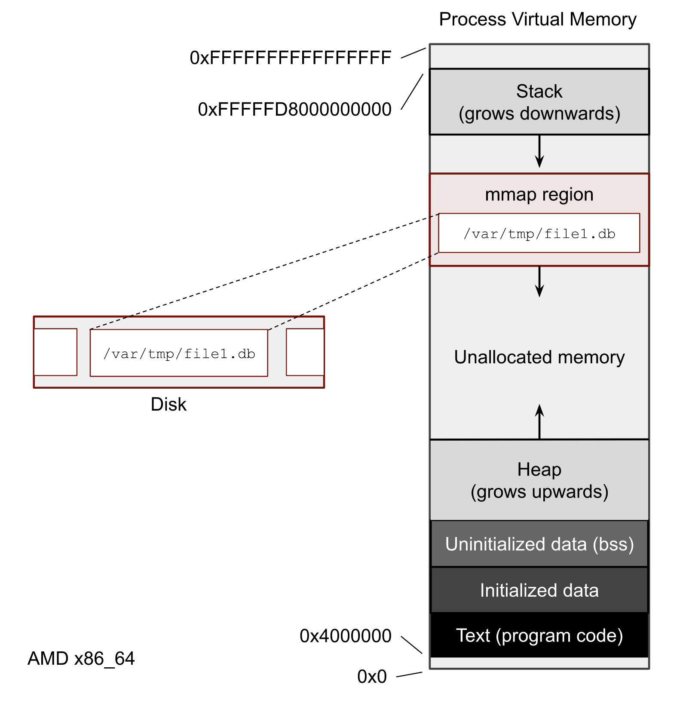

:title: Performance: I/O
:data-transition-duration: 950
:css: hovercraft.css

----

:data-x: r2500

.. class:: chapter

    I/O & Syscalls

Speaking with the kernel 🐧

----

Agenda
======

- How to store bits?
- How does the kernel talk to the storage?
- How can we do I/O over syscalls?
- Profiling and benchmarking.
- Some performance tips.

.. image:: images/waterpipe.png
   :width: 50%

----

Typical terms
=============

* *Latency:* Time until the first drop of water arrives.
* *Throughput:* Current volume of water per time.
* *Bandwidth:* Maximum throughput. (liter/time)

|
|

.. list-table::
   :widths: 25 25 50
   :header-rows: 1

   * - Examples:
     - *Low latency*
     - *High latency*
   * - *Low throughput*
     - **SDCards**
     - **SSHFS**
   * - *High throughput*
     - **SSD**
     - **HDD**

.. note::

    Fun fact: An extreme example of high latency with high throughput is IPoAC
    (IP over Avian Carrier), i.e. sticking an USB stick on a homing pidgeon.
    This was even standardized (jokingly):
    https://en.wikipedia.org/wiki/IP_over_Avian_Carriers

----

Hardware: HDDs
==============

.. image:: images/hdd.jpg
   :width: 60%

|

* Rotational, stacked disks with reading head.
* Reading head needs to seek to the right position.
* Elevator algorithm for ordering seeks.
* Performance loss at high or low temperature.
* Does not work if moved - bad for laptops.
* Dying, but battled tested & still widely used.

.. note::

   Big advantage: You could debug issues with too many seeks by audio!

----

Hardware: SDDs
==============

.. image:: images/ssd.jpg
   :width: 70%

|

* NAND Flash technology (like USB sticks)
* No expensive seek necessary.
* Limited number of write cycles.
* Becoming cheaper and better every year.

.. note::

    Write software for SSDs. There were some crazy tricks like FIEMAP to make
    applications re-order their reads in the order of how they are placed on disk.
    (Huge speedup on HDD, small speedup on SSD), but those will become pointless
    more and more.

----

SSD Write amplification
=======================

.. image:: images/ssd_write_amplification.png
   :width: 100%

.. note::

   Source: http://databasearchitects.blogspot.com/2021/06/what-every-programmer-should-know-about.html?m=1

   SSDs are divided into blocks (seveal MB), which are divided into pages (often 4K).
   Pages cannot be erased, only blocks can be. Updates of a pages are written to new blocks.
   If space runs out, old blocks with many stale pages are erased and can be re-used.
   The number of physical writes is therefore higher than the number of logical writes.
   The more space is used, the higher the write amplication factor though.

   What we can do about it: Buy bigger SSDs than you need. Also avoid rewriting pages if possible.
   Secret: SSD have some spare space to keep working they don't tell you about.

   Also enable TRIM support if your OS did not yet, but nowadways always enabled.
   This makes it possible for the OS to tell the SSD additional blocks that are not needed anymore.

----

Virtual File System
====================

.. image:: images/vfs.webp
   :width: 100%

.. note::

   Below device drivers: hardware controllers - beyond this talk.
   They can also re-order writes and are mostly concerned with durability,
   i.e. a SSD controller will try to distribute the blocks he used to make sure
   they have a similar amount of write cycles.

----

How do syscalls work?
=====================

.. code-block:: c

    // Example: writing to a file
    // as documented in glibc:
    // ssize_t write(
    //     int fd,           // file descriptor
    //     const void buf[], // data
    //     size_t count      // size of data
    // );
    write(1, "Hello world!\n", 12);

----

**Compiled:**

.. code-block:: asm

    ; use the `write` system call (1)
    movl rax, 1
    ; write to stdout (1) - 1st arg
    movl rbx, 1
    ; use string "Hello World" - 2nd arg
    ; (0x1234 is the addr of the "Hello World!\0")
    movl rcx, 0x1234
    ; write 12 characters - 3rd arg
    movl rdx, 12
    ; make system call via special instruction
    syscall
    ; The return code is now in the RAX register.

.. note::

    All available syscalls and their ids are here: https://filippo.io/linux-syscall-table/

    Only method of userspace to talk to kernel. How to call is ISA specific.

    The syscall instruction performs a context switch: This means the current
    state of the process (i.e. the state of all registers in the CPU) is saved
    away, so it can be restored later. Once done, the kernel sets the register
    to its needs, does whatever is required to serve the system call. When
    finished, the process state is restored and execution continues.

    Context switches also happen when you're not calling any syscalls.
    Simply when the scheduler decide this process is done with execution.

----

Typical syscalls
================

* IO: ``read``, ``write``, ``close``
* Files: ``stat``, ``chmod``, ``mkdir``
* Memory: ``sbrk``, ``mmap``
* Processes: ``fork``, ``kill``, ``wait``
* Network: ``listen``, ``connect``, ``epoll``
* Mysterious: ``ioctl``, ``chroot``, ``mount``

.. note::

   There is a syscall for every single thing that userspace cannot do without the kernel's help.

   Luckily for us, glibc and Go provide us nice names and interfaces to make those system calls.
   They usually provide thin wrappers that also do some basic error checking. Watch out: ``fread``
   is doing buffering in userspace!

   Can anyone think of another syscall not in the list above? exit! chdir ...
   (There are about 300 of them)

   Also, what things are no syscalls? Math, random numbers, cryptography, ...
   i.e. everything that can be done without any side effects or hardware.

----

Typical read I/O
================

.. code-block:: c

    char buf[1024];
    int fd = open("/some/path", O_CREAT|O_RDONLY|O_TRUNC);
    size_t bytes_read = 0;
    while((bytes_read = read(fd, buf, sizeof(buf))) > 0) {
        /* do something with buf[:bytes_read] */
    }
    close(fd);

.. note::

    Looks fairly straightforward and most of you might have written something like that already.
    Maybe even for sockets or other streams. BUT here's the thing: every read needs one syscall
    and all bytes from the file are copied to a userspace-supplied buffer. This model is flexible,
    but costs performance. With mmap() and io_uring we will see options that can, sometimes,
    work with zero copies.

    Sidenote: Always be nice and close your file descriptors.
    That has two reasons:

    * You are only allowed a certain maximum of file descriptors per process.
      (check with  ulimit -a for soft limits and ulimit -aH for hard limits)
    * If you write something to a file close will also flush file contents
      that are not written to disk yet.

----

Typical write I/O
=================

.. code-block:: c

    char buf[1024];
    size_t bytes_in_buf = 0;
    int fd = open("/some/path", O_CREAT|O_WRONLY|O_TRUNC);
    do {
        /* fill buf somehow with data you'd like to write,
         * set bytes_in_buf accordingly.
         */
    } while(write(fd, buf, bytes_in_buf) >= 0)
    fsync(fd);
    close(fd);

.. note::

    Q1: Does this mean that the data is available to read() when write() returned?
    Q2: Is the data saved on disk after write() returns?

    A1: Mostly. There might be exotic edge cases with non-POSIX filesystems,
        but you should mostly be able to assume this.
    A2: No. You should call fsync() to ensure that and even than, it is
        sadly not guaranteed depending on the storage driver and hardware.
        (Kernel has to rely on the hardware to acknowledge received data)

    ---

    There is a bug here though:

    write() returns the number of written bytes. It might be less than `bytes_in_buf`
    and this is not counted as an error. The write call might have simply been
    interrupted and we expect that it is called another time with the remaining data.
    This only happens if your program uses POSIX signals that were not registed with
    the SA_RESTART flag (see `man 7 signal`). Since it's default, it's mostly not an
    issue in C.

    Go hides this edgecase for you in normal likes fd.Write() or io.ReadAll().
    However, the Go runtime uses plenty of signals and if you use the `syscalls`
    package for some reason, then you might be hit by this kind of bug.
    This does not affect only write() but also read() and many other syscalls.

    Also please note: There is some error handling missing here.

----

»Buffered« I/O
==============

* Almost all I/O is buffered, but some is double buffered.
* ``fread()``: Does buffering in userspace; calls ``read()``.
* ``bufio.Reader``: Same thing in Go.

**Usecases:**

* You need to read byte by byte.
* You need to "unread" some bytes frequently.
* You need to read easily line by line.
* You have logic that does small reads.

*Otherwise:* Prefer the simpler version.

.. note::

    Userspace buffered functions. No real advantage, but limiting and confusing
    API. Has some extra features like printf-style formatting. Since it imposes
    another copy from its internal buffer to your buffer and since it uses
    dynamic allocation for the FILE structure I tend to avoid it.

    In Go the normal read/write is using the syscall directly,
    bufio is roughly equivalent to f{read,write} etc.
    fsync() is a syscall, not part of that even though it starts with "f"

----

Syscalls are expensive
======================

.. code-block:: bash

   $ dd if=/dev/urandom of=./x bs=1M count=1024
   $ dd if=x of=/dev/null bs=1b
   4,07281 s, 264 MB/s
   $ dd if=x of=/dev/null bs=32b
   0,255229 s, 4,2 GB/s
   $ dd if=x of=/dev/null bs=1024b
   0,136717 s, 7,9 GB/s
   $ dd if=x of=/dev/null bs=32M
   0,206027 s, 5,2 GB/s

Good buffer sizes: :math:`1k - 32k`

.. note::

    Each syscall needs to store away the state of all registers in the CPU
    and restore it after it finished. This is called "context switch".

    Many syscalls vs a few big ones.

    Try to reduce the number of syscalls,
    but too big buffers hurt too.

----

Making syscalls visible
=======================

.. code-block:: bash

    # (Unimportant output skipped)
    $ strace ls -l /tmp
    openat(AT_FDCWD, "/tmp", ...) = 4
    getdents64(4, /* 47 entries */, 32768) = 2256
    ...
    statx(AT_FDCWD, "/tmp/file", ...) = 0
    getxattr("/tmp/file", ...) = -1 ENODATA
    ...
    write(1, "r-- 8 sahib /tmp/file", ...)

.. note::

   Insanely useful tool to debug hanging tools
   or tools that crash without a proper error message.
   Usually the last syscall they do gives a hint.

   Important options:

   -c: count syscalls and stats at the end.
   -f: follow also subprocesses.

----

Page cache
==========

.. image:: images/page-cache.png
   :width: 100%

.. note::

    * All I/O access is cached using the page cache (dir + inode)
    * Free pages are used to store recently accessed file contents.
    * Performance impact can be huge.
    * Writes are asynchronous, i.e. synced later

    Good overview and more details here:
    https://biriukov.dev/docs/page-cache/2-essential-page-cache-theory/

----

Caveat: Writes are buffered!
============================

.. code-block:: bash

   # wait for ALL buffers to be flushed:
   $ sync
   # pending data is now safely stored.

.. code-block:: c

   // wait for specific file to be flushed:
   if(fsync(fd) < 0) {
        // error handling
   }
   // pending data is now safely stored.

.. note::

   That's why we have the sync command before the drop_cache command.

----

Clearing the cache
==================

For I/O benchmarks *always* clear caches:

.. code-block:: bash

    # 1: Clear page cache only.
    # 2: Clear inodes/direntries cache.
    # 3: Clear both.
    sync; echo 3 | sudo tee /proc/sys/vm/drop_caches

|

.. class:: example

    Example: code/io_cache

----

Alternative to ``fsync()``
==========================

.. code-block:: bash

    # Move is atomic!
    $ cp /src/bigfile /dst/bigfile.tmp
    $ mv /dst/bigfile.tmp /dst/bigfile

.. note::

    This only works obviously if you're not constantly updating the file,
    i.e. for files that are written just once.

----

Detour: Filesystems
===================

Defines layout of files on disk:

* **ext2/3/4**: good, stable & fast choice.
* **fat8/16/32**: simple, but legacy; avoid
* **NTFS**: slow and only for compatibility.
* **XFS**: good with big files.
* **btrfs**: feature-rich, can do CoW & snapshots.
* **ZFS**: highly scalable and very complex.
* **sshfs**: remote access over FUSE
* ...

.. note::

    Actual implementation of read/write/etc. for a single
    filesystem like FAT, ext4, btrfs. There are different ways
    to layout and maintain data on disk, depending on your use case.

    Syscalls all work the same, but some filesystems have
    better performance regarding writes/reads/syncs or
    are more targeted at large files or many files.

    Most differences are admin related (i.e. integrity, backups,
    snapshots etc.)

----

Detour: Fragmentation
=====================

.. image:: images/windows_fragmentation.jpg
   :width: 100%

.. note::

    What OS do you think of when you hear "defragmentation"? Right, Windows.
    Why? Because NTFS used to suffer from it quite heavily.
    FAT suffered even more from this.

    Fragmentation means that the content of a file is not stored as one
    continuous block, but in several blocks that might be scattered all over
    the place, possibly even out-of-order (Block B before Block A). With
    rotational disk this was in issue since the reading head had to jump all
    over the place to read a single file. This caused noticeable pauses.

    Thing is: Linux filesystems rarely require defragmentation and if
    you are in need of defragmentation you are probably using an exotic enough
    setup that you know why.

    Most Linux filesystems have strategies to actively, defragment files (i.e.
    bringing the parts of the file closer together) during writes to that file.
    In practice, it does not matter anymore today.

----

Detour: Tweaking
================

* Do not fill up your filesystem.
* Do not stack layers (``overlayfs``, ``luks``, ``mdadm``)
* Do not enable ``atime`` (Access time, ``noatime``)
* Disable journaling if you like to live risky.

.. note::

   Performance is not linear. The fuller the FS is the,
   more it will be busy with background processes cleaning
   things up.

   Stacking filesystems (like with using encryption) can slow things
   down. Often this without alternatives though. Only with RAID you
   have the option to choose hardware RAID.

   Journaling filesystems like ext4 use something like a WAL. They write the
   metadata and/or data to a log before integrating it into the actual
   data structure (which is more complex and takes longer to commit).
   Data is written twice therefore with the advantage of being able to
   recover it on crash or power loss. Disabling it speeds things up
   at the risk of data loss (which might be okay on some servers).

----

Detour: FUSE
============

.. image:: images/fuse.png
   :width: 100%

----

``mmap()``
==========

.. code-block:: c

    // Handle files like arrays:
    int fd = open("/var/tmp/file1.db")
    char *map = mmap(
        NULL,                 // addr
        1024                  // map size
        PROT_READ|PROT_WRITE, // acess flags
        MAP_SHARED            // private or shared
        fd,                   // file descriptor
        0                     // offset
    );

    // copy string to file with offset
    strcpy(&map[20], "Hello World!");

----

.. note::

    Maybe one of the most mysterious and powerful features we have on Linux.

    Typical open/read/write/close APIs see files as streams. They are awkward to
    use if you need to jump around a lot in the file itself (like some datbases do).

    With mmap() we can handle files as arrays and let the kernel manage
    reading/writing the required data from us magically on access. See m[17] above,
    it does not require reading the respective part of the file explicitly.

    Good mmap use cases:

    * Reading large files (+ telling the OS how to read)
    * Jumping back and forth in big files.
    * Sharing the file data with several processes in a very efficient way.
    * Zero copy during reading! No buffering needed.
    * Ease-of-use. No buffers, no file handles, just arrays.

    Image source:

    https://biriukov.dev/docs/page-cache/5-more-about-mmap-file-access/

----

``mmap()`` controversy
======================

.. image:: images/mmap_for_db.png
   :width: 42%

|

* Some databases use ``mmap()`` (*Influx, sqlite3, ...*)
* Some people `advise vehemently against it <https://db.cs.cmu.edu/mmap-cidr2022>`_. 💩
* For good reasons, but it's complicated.
* Main argument: Not enough control & safety.
* For some usecases ``mmap()`` is fine for databases.

----

To sync or to async? 🤔
=======================

.. note::

   https://unixism.net/loti/async_intro.html

----

``io_uring``
=============

.. image:: images/iouring.png
   :width: 100%

----

``O_DIRECT``
============

.. code-block:: c

   // Skip the page cache; see `man 2 open`
   int fd = open("/some/file", O_DIRECT|O_RDONLY);

   // No use of the page cache here:
   char buf[1024];
   read(fd, buf, sizeof(buf));

.. note::

    This flag can be passed to the open() call.
    It disables the page cache for this specific file handle.

    Some people on the internet claim this would be faster,
    but this is 90% wrong. There are 2 main use cases where O_DIRECT
    has its use:

    * Avoiding cache pollution: You know that you will not access the pages of
      a specific file again and not want the page cache to remember those
      files. This is a micro optimization and is probably not worth it. More or
      less the same effect can be safely achieved by fadvise() with
      FADV_DONTNEED.

    * Implementing your own "page cache" in userspace. Many databases use this,
      since they have a better idea of what pages they need to cache and which
      should be re-read.

----

I/O scheduler 👎
================

`Full benchmark <https://www.phoronix.com/review/linux-56-nvme>`_

.. note::

    Re-orders read and write requests for performance.

    * ``none``: Does no reordering.
    * ``bfq``: Complex, designed for desktops.
    * ``mq-deadline``, ``kyber``: Simpler, good allround schedulers.

    In the age of SSDs we can use dumber schedulers.
    In the age of HDDs schedulers were vital.

----

``ionice`` 👎
=============

.. code-block:: c

    # Default level is 4. Lower is higher.
    $ ionice -c 2 -n 0 <some-pid>

.. note::

    Well, you can probably guess what it does.

----

``madvise()`` & ``fadvise()``
=============================

.. image:: images/fadvise_bench.png
   :width: 100%

.. class:: example

   Example: code/fadvise

.. class:: example

   Example: code/madvise

.. note::

    fadvise() and madvise() can be used to give the page cache hints on what
    pages are going to be used next and in what order. This can make a big difference
    for complex use cases like rsync or tar, where the program knows that it needs
    to read a bunch of files in a certain order. In this case advises can be given
    to the kernel quite a bit before the program starts reading the file.

    The linked examples try to simulate this by clearing the cache, giving a advise,
    waiting a bit and then reading the file in a specific order.

    The examples also contain some noteable things:

    * Reading random is much slower than reading forward.
    * Reading backwards is the end boss and really much, much slower.
    * hyperfine is a nice tool to automate little benchmarks like these.
    * Complex orders (like heaps or tree traversal) cannot be requested.
    * mmap does not suffer from the read order much and is much faster
      for this kind of no-copy-needed workload.

----

Why is `cp` faster?
===================

.. code-block:: go

    package main

    import(
        "os"
        "io"
    )

    // Very simple `cp` in Go:
    func main() {
        src, _ := os.Open(os.Args[1])
        dst, _ := os.Create(os.Args[2])
        io.Copy(dst, src)
    }

.. note::

    `cp` is not faster because it copies data faster, but
    because it avoids copies to user space by using specialized calls like:

    * ioctl(5, BTRFS_IOC_CLONE or FICLONE, 4) = 0 (on btrfs)
    * copy_file_range() - performs in-kernel copy, sometimes even using DMA

    Find out using `strace cp src dst`.
    If no trick is possible it falls back to normal buffered read/write.

----

Reduce number of copies
=======================

* Do not copy buffers too often (🤡)
* Use ``readv()`` to splice existing buffers to one.
* Use hardlinks if possible
* Use CoW reflinks if possible.
* ``sendfile()`` to copy files to Network.
* ``copy_file_range()`` to copy between files.

----

Good abstractions
=================

.. code-block:: go

    type ReaderFrom interface {
        ReadFrom(r Reader) (n int64, err error)
    }

    type WriterTo interface {
        WriteTo(w Writer) (n int64, err error)
    }

.. note::

    You might have heard that abstractions are costly from a performance point
    of view and this partly true. Please do not take this an excuse for not adding
    any abstractions to your code in fear of performance hits.

    Most bad rap of abstractions come from interfaces that are not general
    enough and cannot be extended when performance needs arise.

    Example: io.Reader/io.Writer/io.Seeker are very general and hardly specific.
    From performance point of view they tend to introduce some extra allocations
    and also some extra copying that a more specialized implementation might get
    rid of if it would know how it's used.

    For example, a io.Reader that has to read a compressed stream needs to read
    big chunks of compressed data since compression formats work block
    oriented. Even if the caller only needs a single byte, it still needs to
    decompress a whole block. If the API user needs another byte a few KB away,
    the reader might have to throw away the curent block and allocate space for
    a new one, while seeking in the underlying stream. This is costly.

    Luckily, special cases can be optimized. What if the reader knows that the whole
    stream is read in one go? Like FADV_SEQUENTIAL basically. This is what WriteTo()
    is for. A io.Reader can implement this function to dump its complete content to
    the writer specified by `w`. The knowledge that no seeking is required allows
    the decompression reader to make some optimizations: i.e. use one big buffer,
    no need to re-allocate, parallelize reading/decompression and avoid seek calls.

    So remember: Keep your abstractions general, check if there are specific
    patterns on how your API is called and offer optimizations for that.

----

I/O performance checklist: *The sane part*
===========================================

1. Avoid I/O. (🤡)
2. Use a sane buffer size with ``read()``/``write()``.
3. Use append only writes if possible.
4. Read files sequential, avoid seeking.
5. Batch small writes, as they evict caches.
6. Avoid creating too many small files.
7. Make use of ``mmap()`` where applicable.
8. Reduce copying (``mmap``, ``sendfile``, ``splice``).
9. Compress data if you can spare the CPU cycles.

.. note::

    1. In many cases I/O can be avoided by doing more things in memory
       or avoiding duplicate work.
    2. Anything between 1 and 32k is mostly fine. Exact size depends
       on your system and might vary a little. Benchmark to find out.
    3. Appending to a file is a heavily optimized flow in Linux. Benefit
       from this by designing your software accordingly.
    4. Reading a file backwards is much much slower than reading it
       sequentially in forward direction. This is also a heavily optimized
       case. Avoid excessive seeking, even for SSDs (syscall overhead +
       page cache has a harder time what you will read next)
    5. Small writes of even a single byte will mark a complete page
       from the page cache as dirty, i.e. it needs to be written.
       If done for many pages this will have an impact.
    6. Every file is stored with metadata and some overhead. Prefer to
       join small files to bigger ones by application logic.
    7. mmap() can be very useful, especially in seek-heavy applications.
       It can also be used to share the same file over several processes
       and it has a zero-copy overhead.
    8. Specialized calls can help to avoid copying data to userspace and
       do a lot of syscalls by shifting the work to the kernel. In general,
       try to avoid copying data in your application as much as possible.
    9. If you have really slow storage (i.e. SD-cards) but a fast CPU,
       then compressing data might be an option using a fast compression
       algorithm like lz4 or snappy.

----

I/O performance checklist: *The deseperate part*
=================================================

10. Use ``io_uring``, if applicable.
11. Buy faster/specialized hardware (``RAID 0``).
12. Use no I/O scheduler (``none``).
13. Tweak your filesystems settings (`noatime`).
14. Use a different filesystem (``tmpfs``)
15. Slightly crazy: ``fadvise()`` for cache warmup.
16. Maybe crazy: use ``O_DIRECT``
17. Likely crazy: skip ``fsync()/msync()``)
18. Do not fill up your FS/SSD fully.

.. note::

    10. io_uring can offer huge benefits, especially when dealing
        with many files and parallel processing of them. It is definitely
        the most complex of the 3 APIs of read+write / mmap / io_uring
        and its usage most be warranted.
    11. Always a good option and often the cheapest one. RAID 0 can,
        in theory, speed up throughput almost indefinitely, although
        you'll hit limits with processing speeds quite fast.
    12. Mostly standard now. I/O schedulers were important in the age
        of HDDs. Today, it's best to skip scheduling (to avoid overhead)
        by using the `none` scheduler.
    13. If raw performance is needed, then you might tweak some filesystem
        settings, as seen before.
    14. Some filesystems are optimized for scaling and write workloads (XFS),
        while others are more optimized for desktop workloads (ext4). Choose
        wisely. The pros and cons go beyond the scope of this workshop.
        If you're happy with memory, you can of course ``tmpfs`` which is
        the fastest available FS - because it just does not use the disk.
    15. fadvise() can help in workloads that include a lot of files.
        The correct usage is rather tricky though.
    16. Some databases use direct access without page cache to implement
        their own buffer pools. Since they know better when to keep a page
        and when to read it from disk again.
    17. If you do not care for lost data, then do not use fsync() to ensure that
        data was written.
    18. Full SSDs (and filesystem) suffer more from write amplification and
        finding more free extents becomes increasingly challenging.

----

Fynn!
=========

|

.. class:: big-text

    🏁

|

.. class:: next-link

    **Next:** `Concurrency <../5_concurrent/index.html>`_: Make things confusing fast 🧵
