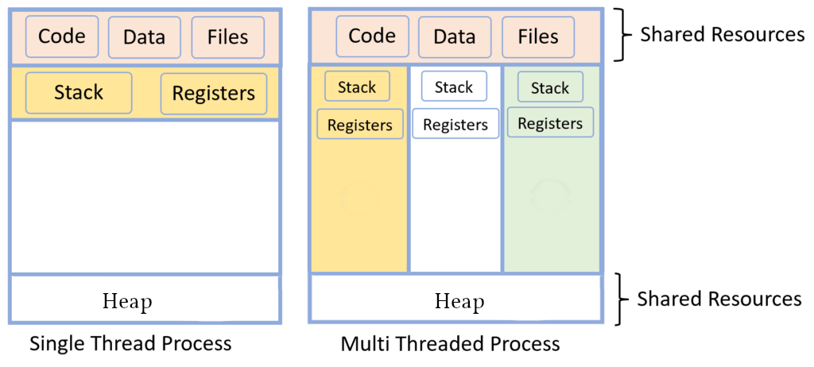

:title: Performance: Concurrency
:data-transition-duration: 950
:css: hovercraft.css

----

:data-x: r2500

.. class:: chapter

   Concurrency

Make things confusing fast 🧵

----

Agenda
======

* Intro
* Parallel primitives
* Parallel problems
* Parallel patterns
* A hard problem

.. note::

   Examples in this workshop will be in Go. Reason: It's rather simple there. C
   requires pthreads, which is a bit of an arcane library. Python has threads,
   but they suck greatly (GIL). Other languages like Javascript are single threaded

   by nature (well, there are web workers, but that's embarassing). Parallel
   programming in bash would be fun, but you might not share my sense of humor.

.. image:: images/thread.jpg
   :width: 40%

----

Parallel programming
====================

*»The art of distributing work to maximize
the use of resources with minimal overhead.«*

.. class:: small-text

    (while not shooting yourself in the knee by getting confused with the mindboggling behemoth you created)

.. note::

    It really is an art, since there are no easy guidelines.

    There are two ways to be comfortable writing parallel code:

    * Being very experienced and having made a lot of mistakes.
    * Being fearless and not be aware of the possible problems.

----

There's always a xkcd
=====================

.. image:: images/xkcd_parallel.webp
   :width: 100%

----

Rule of thumb 👍
================

|

.. class:: big-text

    **Don't.** ¹

.. class:: small-text

   ¹ Unless you really, really need the performance and you proved this by benchmarks.

.. note::

   Just to repeat: Concurrency hurts readability, will almost inevitably cause bugs
   and eat your hamster. Proceed at your own risk.

----

.. class:: quote

    If you write the code as cleverly as possible, you are,
    by definition, not smart enough to debug it.

| - **Brian Kernighan**

.. note::

    Especially true for parallel programming as our brain is really not build
    to think this way. So our mind's horizon is never far away when doing
    parallel programming.

----

Concurrent vs Parallel
======================

What's the difference again?

.. note::

    Concurrent = execution might be interrupted at an time.
    Parallel = several instructions get executed at the same time.

    All parallel programs are also concurrent.

----

What are processes?
===================

- Processes are a lightweight way to schedule work over all available cpu cores.
- Processes get started by ``fork()`` (except PID 1)
- Processes focus on memory isolation - memory can only be shared via IPC (unix sockets, pipes, shared memory, network...)
- Processes have their own ID (PID)

----

What are threads?
=================

- Threads are lightweight processes (again?)
- Threads get started by ``pthread_create()`` (except first thread, which exists implicitly)
- Threads share the heap of the process but have each their own stack
- Threads have their own ID (TID)

.. note::

   Threads are scheduled like processes by the kernel. No real difference is made between
   processes and threads in that regard.

----

What are coroutines?
====================

- Coroutines are lightweight threads (oh come on)
- Coroutines are implemented completely in user space using a scheduler
- Every detail depends on the individual programming languages' implementation
- »Goroutines« are one example of a coroutine implementation. »Fibers« are another often used term.
- Not a kernel concept, kernel scheduler does not care.

.. note::

   Good example of software evolution. Old concepts are never cleaned up. Just new concepts
   get added that enhance (in the best case) the old concepts. I call this toilet paper development:
   If it stinks, put another layer over it.

   In case of Go, there is a scheduler that is started inside every program written in Go. It starts
   a number of threads (see GOMAXPROCS) and schedules the set of go routines over the set of threads.

----

CPU Perspective
===============

.. image:: images/time_sharing_threads.png

.. note::

   Note: Diagram is only for a single core.
   Several cores of course can do the same.

----

No magic bullets 🔫
====================

.. image:: images/epoll_vs_othersz.png
   :width: 120%

.. note::

    Benchmark of a webserver handling dummy requests:

    * forking: Spawn a new process per request.
    * preforking: Use a pool of worker process.
    * threaded: Spawn a new thread per request.
    * prethreaded: Use a pool of woerk threads.
    * poll: Single threaded using the poll() syscall.
    * epoll: Single threaded using the epoll() syscall.

    "Concurrency" is the number of requests per sec thrown
    at the server, y axis is the actual handled requests.

    Just throwing multithreading on a problem makes it complex,
    but does not necessarily solve it.

    Source: https://unixism.net/loti/async_intro.html

    More details on the individual benchmarks:

    https://unixism.net/2019/04/linux-applications-performance-introduction

    Most of the time, when used in the right dose, multithreaded programming
    can easily speed up things. That's why this part of the workshop focuses more
    on the safe use of parallel programming instead of squeezing every last bit
    of performance out of parallel programming. Multiple threads are basically
    a single optimization and deserve their own chapter therefore.

    The contents in this part of the workshop are best applied with the understanding
    of the CPU and Memory chapters.

----

Preemption
==========

.. note::

    Linux' scheduling is preemptive. This means that a high priority task
    can be worked on by interrupting a task with lower priority.

    Preemption points: The scheduler can interrupt a process at pretty much
    any point in time. Normally this happens in any of those cases:

    * Process used up their time share.
    * Process made a syscall. While execution happens in kernel, other
      cores can work up on other tasks (especially for things like recv(),
      or read() where the kernel also just waits on hardware)
    * When the process calls sched_yield() (or sleep())

----

Synchronization
===============

.. note::

    As with humans that work on a project in paralle, parallel jobs
    need to synchronize to be useful. There is a big toolbox to do so.

    If you use processes you obviously need to synchronize too sometimes.
    Potential ways can be to use filesystem locks or mlock() on shared memory.

    Failure to synchronize leads to race conditions and other bugs that are
    really not fun to find. Debuggers won't work and prints might change
    timings so deadlocks or race conditions might not always occur.

----

Critical Section
================

.. code-block:: go

    var count int

    func inc() {
        for idx := 0; idx < 100000; idx++ {
            // critical section start
            count++
            // critical section end
        }
    }

    func main() {
        go inc()
        go inc()
        time.Sleep(time.Second)
        fmt.Println(count)
    }

.. note::

    Keep critical sections as small as possible - for performance & sanity.

    Question for you: What synchronisation primitives do you know?

    If you don't mention "sleep" then you're a little dishonest ;-)

    Why does this not happen if we reduce the 100000 to e.g. 1000?

----

Parallel code smell #1 👃
==========================

.. class:: quote

    Never start a goroutine/thread/process without knowing how it will stop.

| - **Dave Cheney**

.. note::

   The previous slide had a race condition: The program might have exited before
   the go routine do anything. In general: You should think about how your goroutines
   are terminated.

   Why? Similar to memory leaks, the phenomen of goroutine leaks exist. Most of them
   come from place where people think "Ah, I don't need to close that go routine".

   More background:
   https://dave.cheney.net/2016/12/22/never-start-a-goroutine-without-knowing-how-it-will-stop

----

Primitive: ``sleep()``
======================

Just kidding. **Don't!**

.. class:: small-text

   Okay, let's be honest. Sometimes you have no other way and we all did it.

.. note::

    In all seriousness: there are some edge cases where sleep() is the only
    way to reach some sort of sync state. Especially when we have to wait
    on some external process that we cannot control.

    If you happen to have such an edge case, then do it in a loop:

    for sync_condition_not_met() { sleep(small_amount_of_time) }

    But often enough it's just a lazy way to wait until something has finished.
    This turns out to be flaky and depends often on the execution speed of the machine.
    Which is one reason why flaky unittests exist.

    And yes, I'm very guilty of this myself.

----

Primitive: Mutex
=================

A binary semaphore.

.. code-block:: go

    var count int
    var mu sync.Mutex

    func inc() {
        for idx := 0; idx < 100000; idx++ {
            mu.Lock()
            count++
            mu.Unlock()
        }

        // or better if a complete function is locked:
        // mu.Lock()
        // defer mu.Unlock()
    }

.. note::

   Variants:

   - recursive mutex: can be locked several times, if unlocked the same time.
   - rw-mutex: Allows one writer, but many readers.

----

Primitive: Channel
==================

.. code-block:: go

   // buffered channel with 10 items
   c1 := make(chan int, 10)
   c1 <- 1 // send
   fmt.Println(<-c1) // recv

   // unbuffered channel:
   c2 := make(chan int)
   c2 <- 1 // send
   // deadlock!

.. note::

    Might be called prioq, fiber or something in other languages.
    Basically a slice or linked list protected with a mutex (in case of a buffered channel)
    or a single data field (in case of unbuffered channel)

    Channels can be buffered or unbuffered:

    * unbuffered: reads and writes block until the other end is ready.
    * buffer: blocks only when channel is full.

    Channels can be closed, which can be used as signal to stop.
    A send to a closed channel panics.
    A recv from a closed channel blocks forever.

    A nil channel panics when something is send.
    A nil channel block forever on receiving.

    We will see channels later in action.

----

Channel rules
=============

.. code-block:: go

   c1 := make(chan int) // unbuffered
   c2 := make(chan int, 10) // buffered

   // A send on c1 would block until another go routine
   // will receive from it. On ch2 we can send 10 times
   // until the same happens.

   // channel are open or closed.
   // send on a closed channel panics
   // recv on a closed channel takes forever
   close(c1)

----

Primitive: Semaphor
====================

.. code-block:: go

    // Init the semaphore:
    semaphore := make(chan bool, 10)
    for i := 0; i < cap(tokens); i++ {
        semaphore <- i
    }

    // Limit number of jobs to 10 parallel jobs:
    for _, job := range jobs {
        <-semaphore
        go func(job Job) {
            // ... do work here ...
            semaphore <- true
        }(job)
    }

.. note::

    Very easy way to limit the number of go routines.
    Basically a lightweight pool - good for one-time jobs.

    Metaphor: A bouncer before a club.

    It's corona times and he knows that only 10 people are allowed in the club
    (sad times) He counts up when he let's somebody in and counts down when
    someone leaves. If the club is full new visitors have to wait. Whem somebody
    leaves then a new person may enter the "critical section" (club).

----

Primitive: Select
=================

.. code-block:: go

    select {
        case <-c1:
            // executed when c1 has
            // incoming data.
        case result := <-c2:
            // executed when c2 has
            // incoming data.

        default:
            // executed when nothing
            // on both channels. If no
            // 'default' given then
            // select blocks.
            // Without default, we block.
    }

.. note::

   select exists to be multiplex between several channels
   and to figure out if we way send or receive from a channel.

   This feature does not exactly exist in most other languages.
   Usually condition variables are used for this outside of Go
   or something like await/asnyc in languages that have it.

----

Primitive: Barrier
==================

.. code-block:: go

    wg := &sync.WaitGroup{}
    for idx := 0; idx < 10; idx++ {
        wg.Add(1)
        go func() {
            defer wg.Done()
            someJob(1, 2, 3)
        }()
    }

    // wait here for all jobs to finish:
    wg.Wait()

.. note::

    A barrier is basically an inverted semaphore: Instead of counting up
    until you hit a limit (which means that too many jobs at the same time),
    you count down until you reach zero (which means that all jobs are done)
    All threads have to arrive a certain point before any can continue.

    Alternative names: Wait Groups, Latch.

    Question: Would it still be correct if we move the wg.Add(1) to the go routine?
    No! There's a chance that wg.Wait() would not wait yet, because no go routine
    did start yet.

----

Primitive: Cond Var
===================

.. code-block:: go

    // Init:
    m := sync.Mutex{}
    c := sync.NewCond(&m)
    // ...
    // Sender:
    c.L.Lock() // c.L == m
    newJobReceived = true
    c.Broadcast() // or c.Signal() for a single go routine.
    c.L.Unlock()
    // ...
    // Receiver:
    c.L.Lock()
    for !newJobReceived {
        c.Wait()
    }
    // Do something here.
    c.L.Unlock()

.. note::

    Probably the most brainfuck-y of the primitives.

    * Broadcast or notify a single thread.
    * Seldomly used in Go, but has their use cases.
    * Use case: waiting on a condition without busy polling
      and where the use of channels would be awkward (channels
      suck if you have to wake up several go routines, as messages
      are consumed)

    When to use:

    Channels are a good replacement if you just need to wake up
    a single go routine. If you need to wake up many go routines
    at the same time (Broadcast()) then condition variables are
    way more efficient.

    Context is a pattern that can be used in a similar way
    (although rather exclusively for cancellation)

----

Primitive: Promises
===================

.. code-block:: go

    func fetchData(url string) <-chan Result {
        ch := make(chan Result, 1)
        go func() {
            // use `url` somehow and do some potentially
            // long running I/O work.
            ch <- Result{...}
        }()

        return ch
    }

    func main() {
        promise := longRunningTask(1, 2)
        // ...do something else...
        // await the result:
        fmt.Println(<-promise)
    }

.. note::

    Promises are a good way to make asynchronous code look like synchronous code.
    A good example is fetching stuff via HTTP. While waiting for the response you can
    potentially do something else.

    You can also chain promises together. I.e. automatically do something
    once the promise returns - by adding another go routine. This is called
    promise chaining.

    Other languages like Python/Javascript have first-class support
    for async/await which kinda doing the same background. Go-routines
    are however a more flexible concept and it's easy to write libraries
    that emulate this behaviour (and others have done so)

----

Primitive: Atomics
==================

.. code-block:: go

    var n atomic.Uint64{}
    n.Store(val int64)
    n.Load() (curr int64)
    n.Add(delta int64) (new int64)
    n.Swap(val int64) (old int64)
    n.CompareAndSwap(old, new int64) (swapped bool)

.. note::

    Atomic: A thing that happens in one go. Either it fails completely and
    leaves no trace or it work fully. Some operations can be executed on the
    CPU atomically with guarantees of never being interrupted by another
    thread, signal or ISR. Those are the above operations.

    If you chain several atomic operations (e.g. Store+Load) they
    are of course not atomic together!

----

Primitive: CAS
==============

.. code-block:: go

    func (cd countdown) Stop() {
        cas := atomic.CompareAndSwapInt32
        if !cas(&cd.isStopped, 0, 1) {
            // do not stop code twice if
            // Stop() called more than once.
            return
        }

        // Do actual stopping here.
    }

.. note::

    The most exotic looking is CompareAndSwap and surprisingly it's the one that
    is the most important one. It is roughly comparable to this code:

    .. code-block:: go

        if *n == old {
            *n = new
            return true
        }

        return false

    It's main use is implementing lockfree datastructures that notice
    when a value was modified behind their back.

    Additional use: Making sure that we don't stop twice.
    (actual code example in the firmare's ui)

----

Primitive: Lockfree data structures
===================================

.. code-block:: go

    func (q *Queue) Pop() *Elem {
        for {
            p := q.head
            if p.next == nil {
                return nil
            }

            // Is `p` still the value that
            // we expect it to be?
            if cas(q.head, p, p.next) {
                // value was swapped!
                return p.next.elem
            }
        }
    }

.. note::

    Let's recall what a Pop() actually does:

    1. Fetch the head of the queue so we can return it.
    2. Make the node after the old head the new head.

    (this assumes that the queue is based on a linked list)

    Those are two operations and they are not atomic together.
    If two threads call Pop() at the same time, we might have the issue
    that one thread overwrites the results of the other.

    In a traditional implementation we could use a mutex to protect this.
    Newer CPUs (i.e. >Year 2000) have CAS instructions, so we can implement
    it without locks at all.

----

Contention & Starvation
=======================

* *Contention:* Threads competing for a common resource. Causes non-zero waiting.
  Can often not be avoided, just minimized.

|

* *Starvation:* Special case of *Contention* where one »victim« thread is blocked
  from resource access more often that the other »greedy« threads. Pathological
  behavior that should be fixed.

.. note::

    OS-level contention: done by the process/thread scheduler.
    Threads are waiting on sleep, syscalls or waiting on a mutex.

    Program level contention: waiting on locks, busy polling, atomics.

    Lock-free data structures are so popular because they allow
    a little cheat here: No syscalls involved, so they do not get
    scheduled away. Mutex locks involve a call to futex() in some
    cases, which is a syscall.

    How to find out which threads content others or which threads get starved?
    You gonna need to find out with tracing tools!

    Contention: 100 threads that operate on a database that allows at most 10 parallel connections.
    90 threads have to wait while 10 do work. Minimizing means to give the 90 threads some meaningful
    work while they wait.

    Real world example for starvation: Telephone Hotline where some people call
    the hotline all the time automatically, while some normal people don't come through anymore.
    With the example above: Maybe some threads use an outdated db library that makes it more
    unlikely to get a connection from the connection pool.

----

Patterns
========

Several primitives combined build a pattern.

----

Pattern: Pool
=============

Classical producer-consumer problem.

1. Start a limited number of goroutines.
2. Pass each a shared channel.
3. Let each goroutine receive on the channel.
4. Producer sends jobs over the channel.
5. Tasks are distributed over the go routines.

.. note::

   Pools often use a queue (i.e. a channel or some other prioq). I.e. you can
   produce more to some point than you consume. Can be a problem.

.. class:: example

   Example: code/producer_consumer

----

Tracing
=======

.. image:: images/tracer_goroutines.png
   :width: 100%

.. class:: example

   Example: code/producer_consumer

.. note::

    Features of a tracer:

    * View trace: Detailed overview of which core ran which goroutine at what time
      and what blocked the process (like waiting for syscalls).

    * Goroutine analysis: Show stats per goroutine - see screenshot above.
      This is a good overview how "parallel" the go routine actually is.
      Does it do actual work or does it wait to be scheduled or locks?

    * Syscall blocking profile: Overview of contention through syscalls.
      Check this if you suspect that your program is spending time waiting
      for input/output.

    * Scheduler latency profiler: Scheduling goroutines comes with an overhead.
      This overhead is noticeable and the higher it gets the less time there is
      for actually useful stuff. Sometimes go routines just play "yield ping pong".

    Usage:

    * Import "runtime/trace"
    * Open a file descriptor to where you'd like your trace output.
    * Do trace.Start(fd)/trace.Stop() around the desired code portion.
    * Run your program so that it produces a trace output in the file you specified.
    * Run `go tool trace <path>` to start the web ui.

    A bit more background: https://blog.gopheracademy.com/advent-2017/go-execution-tracer

----

Pattern: Pipeline
=================

Several pools connected over channels.

.. code-block:: go

    // DO NOT:
    func work() {
        report := generateReport()
        encoded := report.Marshal()
        compressed := compress(encoded)
        sendToNSA(compressed)
    }

.. note::

   Talk about the naive implementation where time of finish will
   be influenced by a single long running job.

----

.. code-block:: go

    // Instead:
    c1 := make(chan type1)
    c2 := make(chan type2)
    c3 := make(chan type3)

    go func() {
        for job := range c1 {
            c2 <- generateReport()
        }
    }()
    go func() {
        for report := range c2 {
            c3 <- report.Marshal()
        }
    }()

    // ...

.. note::

   This can also be easily combined with the pool pattern to start several go routines per pipeline step,
   allowing us to easily balance out steps that take longer than others. Not shown here, take this as homework.

----

Pattern: Parallel Iterator
==========================

.. code-block:: go

   func iter() chan Elem {
        ch := make(chan Elem, 10)
        go func() {
            a, b := 1, 1
            for {
                ch <- a
                a, b = b, a + b
            }
        }()
        return ch
   }
   for elem := range iter() { ... }

.. note::

    Problem: How to stop? Best to use context.Contex

    Note: You should probably buffer a little here.

----

Problems
========

What kind of problems do we need to solve with primitives and patterns?

----

Problem: Race conditions
========================

.. code-block:: go

    var counter int
    func f() {
        for(idx := 0; idx < 10000; idx++) {
            counter++
        }
    }
    // ...
    go f()
    go f()

----

Solution: Race conditions
=========================

* Use synchronisation primitives.
* Avoid shared state (no globals e.g.)
* Prefer copies over references.
* Use a race detector. (``helgrind``, ``go test -race``)
* Write tests that are multithreaded.
* Use Rust. 😛

.. note::

    Shared state / Copy over reference:

    Channels copy data on send. Copies do have issues when being accessed by
    several threads. There is a small overhead of course, but it is much
    smaller than false sharing. This also means though: Do not send pointers
    over channels, as the pointer value itself is copied but of course not the
    value it points to.

    Less scope is better. If a variable is only visible to a single thread
    or goroutine, then it cannot have issues. Avoid global state anyways.

    Proper synchronisation:

    At some point you need to resort to sync primitives of course.
    If you need to use too much of it, chances are you have an issue
    in your architecture though.

    Race detector / tests / rust:

    Parallel code is complicated. Use whatever tools are available to
    ensure correctness.

----

Tool: Race detector
===================

.. code-block:: bash

    # or for non-tests: go run -race main.go
    $ go test -race ./package
    WARNING: DATA RACE
    Read by goroutine 185:
      net.(*pollServer).AddFD()
          src/net/fd_unix.go:89 +0x398
      ...

    Previous write by goroutine 184:
      net.setWriteDeadline()
          src/net/sockopt_posix.go:135 +0xdf
      ...

.. note::

    Herr Rittler likes this.

    More info: https://go.dev/doc/articles/race_detector

    Disadvantages:

    * Slows down program a little. Sometimes races do not happen anymore
      if -race is enabled.
    * It only sees race conditions that actually happen. If there's no test
      for it, then you won't see a print.

    Still: You should probably enable it in your tests.

----

Problem: Deadlock #1
====================

.. code-block:: go

    ch := make(chan int)

    // thread1:
    ch <- 42

    // thread2:
    if someCondition {
        result := <-ch
    }

.. note::

   Unbuffered channels are prone to deadlocks.
   In this example we will have a deadlock in thread1
   if thread2 does not go into the if block.

   For this we probably should have used a buffered channel.

----

Problem: Deadlock #2
=====================

.. code-block:: go

    func foo() error {
        mu.Lock()
        if err := bar(); err != nil {
            return err
        }

        mu.Unlock()
        return nil
    }

.. note::

   Absolute classic. Forgetting to unlock in one error case.

   Luckily, in Go we have the defer statement, so we can unlock
   the mutex in all cases.

----

Problem: Deadlock #3
=====================

.. code-block:: go

    func foo() error {
        mu1.Lock()
        mu2.Lock()
        // ...
        defer mu1.Lock()
        defer mu2.Lock()
    }
    func bar() error {
        mu2.Lock()
        mu1.Lock()
        // ...
        defer mu2.Lock()
        defer mu1.Lock()
    }

.. note::

   The lock hierarchy needs to be preserved. Otherwise
   deadlocks might happen.

----

Solution: Deadlocks
===================

* Obtain a stacktrace if they happen. (*Ctrl-Backslash*)
* Debugger (if deadlock is not timing sensitive)
* Keep critical sections small.
* Use defer for the ``Unlock``.
* Respect the lock hierarchy.
* Double think if an unbuffered channel will work out.
* Use unidirectional channels and ``select`` in Go.
* Don't be *clever*.

.. note::

   Tip: In Go progamms you can press Ctrl+\ or send SIGABRT or SIGTERM
   to the program to make it print a stack trace.
   Or use a debugger.

.. class:: example

   Example: code/deadlock

----

Problem: Livelock
=================

Example:

* Two persons walking in opposite directions,
  trying to pass each other in a tight corridor.
* When both persons move at the same time left and right
  then hallway is still blocked.
* If infinitely done, then it's a livelock.

.. note::

   A system that does not make any progress for prolonged times.
   Relatively seldom, but can happen.

   Usual cause: Too primitive retry mechanism.

----

Solution: Livelock
==================

* Avoid circular dependencies.
* Use an arbitrator.
* Use exponential backoff.

.. note::

    * Arbitrator: In the metaphor above somebody that has an overview of the situation and tells one person to move.
    * Exponential backoff: Proper retry mechanism with random jitter between retries.

    Real life example: Two processes trying to execute an SQL transaction that depend on each other.
    SQL server will stop the transaction and make them retry - if the retry mechanism is the same, then
    it might take a long time to resolve the situation.

----

Problem: Cancellation
=====================

.. code-block:: go

    resultCh := make(chan int)
    go longRunningJob(resultCh)

    // Give job 5 seconds to complete:
    select {
        case result := <-resultCh:
            // do something with `result`
        case <-time.After(5*time.Second):
            log.Warnf("Oh no! No result yet.")
            // BUT: longRunningJob still running!
    }

----

Solution: `Context`
====================

.. code-block:: go

    // Init:
    parentCtx := context.Background()
    timeout := 5 * time.Second
    ctx, cancel := context.WithTimeout(parentCtx, timeout)

    // Check for cancellation:
    select {
        case <-ctx.Done():
            return ctx.Err()
        default:
            // if not cancelled
            // we land here.
    }

    // Cancellation:
    cancel()

.. note::

    Especially useful for HTTP request handlers.
    In Go, each of them has a context that is cancelled
    when the request is not needed anymore.

----

Context Tree
============

.. image:: images/context.avif
   :width: 80%

----

Takeaways
=========

* Benchmarks before committing your atrocities.
* Always make sure to use proper synchronization.
* Don't use more go routines than you need.
* Avoid false sharing.
* Avoid contention & starvation.
* Write tests that use several go routines (`-race`).
* Don't be clever.

----

You almost made it! Just one slide left!

.. class:: small-text

   And it's a very easy one and won't take a lot of time at all!

----

Brainfuck time 🧠
=================

.. image:: images/philosophers.png
   :width: 50%

|

* Philosophers toggle between »thinking« and »eating«.
* The »eating« phase has a fixed length.
* The »thinking« phase has a random length.
* During »eating« he requires two forks.
* If only one fork is available, they wait until a second one is available.

**Goal:** No philosopher should starve.

.. note::

    Bonus: If you can name all philosophers pictured above.

    Two problems that can occur:

    * Deadlock: Every philosopher took the left fork. None can pick the right fork.
    * Starvation: A single philspopher might be unlucky and never get two forks.

    Solution:

    * Simple: Use a single mutex as "waiter" to stop concurrency.
    * Hard & correct: Use global mutex pluse "hungry" state with semaphor per philosopher.
    * Easier: Give philosophers invdividual rights and priorities.
    * Weird: philosopher talk to each other if they need a fork (i.e. channels)

----

Fynn!
=====

|

.. class:: big-text

    🏁

|

.. class:: next-link

    **Next:** `Bookmark the GitHub repo! <https://github.com/sahib/misc/tree/master/performance>`_
