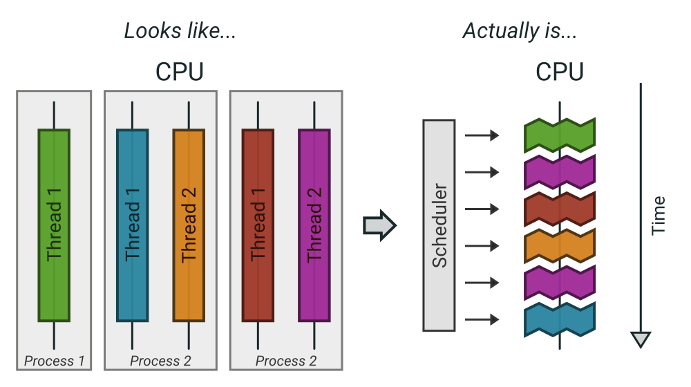

:title: Performance: Concurrency
:data-transition-duration: 1500
:css: hovercraft.css

TODO: go routine profiling
TODO: show executing tracer
TODO: show go race detection.
TODO: epoll / select and sorts?
TODO: show https://unixism.net/loti/async_intro.html like graphs?
TODO: When you start a goroutine, have a plan to stop it.

Maybe steal some things here: https://livebook.manning.com/book/100-go-mistakes-and-how-to-avoid-them/chapter-8/16

Agenda
======

* Intro
* Parallel primitives
* Parallel problems
* Parallel patterns
* A hard problem

----

Is this helpful?
================

.. note::

   Just making it multithreaded doesn't hurt.

----

Parallel programming
====================

The art of distributing work so that we maximize
the number of used CPU cores with minimal overhead.

.. note::

   There are two ways to be comfortable writing parallel code:

   * Being very experienced and having made a lot of mistakes.
   * Being fearless and not be aware of the possible problems.

----

Concurrent vs Parallel
======================

Please define it.

.. note::

    Concurrent = execution might be interrupted at an time.
    Parallel = several instructions get executed at the same time.

----

What are processes?
===================

- Processes are a lightweight way to schedule work over all available cpu cores.
- Processes get started by ``fork()`` (except the first one...)
- Processes focus on memory isolation - memory can only be shared via IPC (unix sockets, pipes, shared memory, ...)
- Processes have their own ID (PID)

----

What are threads?
=================

- Threads are lightweight processes (huh?)
- Threads get started by ``pthread_create()``
- Threads share the heap of the process but have each their own stack
- Threads have their own ID (TID)

.. note::

   Threads are scheduled like processes by the kernel. No real difference is made between
   processes and threads in that regard.

----

What are coroutines?
====================

- Coroutines are lightweight threads (oh come on)
- Coroutines are implemented completely in user space using a scheduler
- Every detail depends on the individual programming languages' implementation
- Goroutines are one example of a coroutine implementation. Fibers are another often used term.

.. note::

   Good example of software evolution. Old concepts are never cleaned up. Just new concepts
   get added that enhance (in the best case) the old concepts. I call this toilet paper development:
   If it stinks, put another layer over it.

----

Summary
=======

----

Synchronization primitives
==========================

Threads & coroutines need to be in sync.

Big toolset of possible ways to do so.

.. note::

   If you use processes you obviously need to synchronize too sometimes.
   Potential ways can be to use filesystem locks or mlock() on shared memory.

   If not used they can be a hell to debug. Debuggers won't work and prints
   might change timings so deadlocks or race conditions might not always occur.

----

Primitive: Sleep
================

Just kidding. Don't!

----

Primitive: Semaphor
====================

.. note::

    A bouncer before a club.
    It's corona times and he knows that only 10 people may be in the club (sad times)
    He counts up when he let's somebody in and counts down when someone leaves.
    If the club is full new visitors have to wait

----

Primitive: Mutex
=================

A binary semaphore.

----

Primitive: Barrier (latch, wait group)
=======================================

An inverted semaphore

.. note::

   All threads have to arrive a certain point before any can continue.

Dining Philosopher's problem as intro to synchronisation -> explain deadlock scenarios and how to debug them.

----

Primitive: Condition variable
=============================

.. code-block::

    c.L.Lock()
    for !condition() {
        c.Wait()
    }
    // condition changed, do something.
    c.L.Unlock()

.. code-block::

    c.L.Lock()
    changeCondition()
    c.Broadcast() // or c.Signal() for a single go routine.
    c.L.Unlock()

.. note::

    * Broadcast or notify a single thread.
    * Seldomly used in Go, but has their use cases.
    * Use case: waiting on a condition without busy polling
      and where the use of channels would be awkward (channels
      suck if you have to wake up several go routines, as messages
      are consumed)

----

Primitive: Atomics
==================

* Store
* Load
* Increment
* Swap
* Compare-And-Swap

.. note::

   Several atomic operations are not atomic of course!

----

Primitive: Channel
==================

.. code-block:: go

   // buffered channel with 10 items
   c := make(chan int, 10)
   c <- 1 // send
   fmt.Println(<-c) // recv

.. note::

    Might be called prioq or something in other languages.
    Basically a slice or linked list protected with a mutex.

    Channels can be buffered or unbuffered:

    * unbuffered: reads and writes block until the other end is ready.
    * buffer: blocks only when channel is full.

    Channels can be closed, which can be used as signal to stop.
    A send to a closed channel panics.
    A recv from a closed channel blocks forever.

    We will see channels later in action.

----

Pattern: Pool
=============

Classical producer-consumer problem.

1. Start a limited number of goroutines.
2. Pass each a shared channel.
3. Let each goroutine receive on the channel.
4. Producer sends jobs over the channel.
5. Tasks are distributed over the go routines.

.. note::

   Pools often use a queue (i.e. a channel or some other prioq). I.e. you can
   produce more to some point than you consume. Can be a problem.

----

Pattern: Limiter
================

.. code-block:: go

    tokens := make(chan bool, 10)
    for i := 0; i < cap(tokens); i++ {
        tokens <- i
    }
    for _, job := range jobs {
        <-tokens
        go func(job Job) {
            // ... do work ...
            tokens <- true
        }(job)
    }

.. note::

   Very easy way to limit the number of go routines.
   Basically a lightweight pool - good for one-time jobs.

----

TODO: Pattern: async / await

Pattern: Pipeline
=================

Several pools connected over channels.

.. code-block:: go

    // DO NOT:
    func work() {
        report := generateReport()
        encoded := report.Marshal()
        compressed := compress(encoded)
        sendToNSA(compressed)
    }

.. note::

   Talk about the naive implementation where time of finish will
   be influenced by a single long running job.

----

Pattern: Parallel Iterator
==========================

.. code-block:: go

   func iter() chan Elem {
        ch := make(chan Elem, 10)
        go func() {
            a, b := 1, 1
            for {
                ch <- a
                a, b = b, a + b
            }
        }()
        return ch
   }
   for elem := range iter() { ... }

.. note::

    Problem: How to stop? Best to use context.Contex

    Note: You should probably buffer a little here.

----

Problem: Shared state
=====================

.. note::

   Easiest solution: Communicate via copies, do not share memory.

----

Problem: Race conditions
========================

.. code-block:: go

    var counter int
    func f() {
        for(idx := 0; idx < 10000; idx++) {
            counter++
        }
    }
    // ...
    go f()
    go f()

---

Solution: Race conditions
=========================

* Avoid shared state. Limit scope where possible.
* Prefer copy over references.
* Use proper synchronisation.
* Use a race detector. (``helgrind``, ``go test -race``)
* Write tests that are multithreaded.
* Use Rust.

----

Problem: Deadlocks
==================

.. code-block:: go

   ch := make(chan int)

   // thread1:
   ch <- 42

   // thread2:
   if !something {
       return
   }

   <-ch

----

Problem Deadlock #2
===================

.. code-block:: go

    func foo() error {
        mu.Lock()
        if err := bar(); err != nil {
            return err
        }

        mu.Unlock()
        return nil
    }

----

Problem Deadlock #3
===================

.. code-block:: go

    func foo() error {
        mu1.Lock()
        mu2.Lock()
        // ...
        defer mu1.Lock()
        defer mu2.Lock()
    }
    func bar() error {
        mu2.Lock()
        mu1.Lock()
        // ...
        defer mu2.Lock()
        defer mu1.Lock()
    }

----

Solution: Deadlocks
===================

* Obtain a stacktrace if they happen.
* Debugger (if deadlock is not timing sensitive)
* Keep critical sections small.
* Use defer for the ``Unlock``.
* Respect the lock hierarchy.
* Double think if an unbuffered channel will work out.
* Use unidirectional channels and ``select`` in Go.
* Don't be clever.

.. note::

   Deadlocks happen frequently when working with channels.

   Tip: In Go progamms you can press Ctrl+\ or send SIGABRT or SIGTERM
   to the program to make it print a stack trace.
   Or use a debugger.

   Don't be clever: There's a saying:

   If you write the code as cleverly as possible, you are,
   by definition, not smart enough to debug it.
   --Brian Kernighan,

   And our mind's horizon is never far away when doing parallel programming.

----

Problem: Livelock
=================

Example:

* Two persons walking in opposite directions,
  trying to pass each other in a tight corridor.
* When both persons move at the same time left and right
  then hallway is still blocked.
* If infinitely done, then it's a livelock.

.. note::

   A system that does not make any progress for prolonged times.
   Relatively seldom, but can happen.

   Usual cause: Too primitive retry mechanism.

----

Solution: Livelock
==================

* Avoid circular dependencies.
* Use an arbitrator.
* Use exponential backoff.

.. note::

    * Arbitrator: In the metaphor above somebody that has an overview of the situation and tells one person to move.
    * Exponential backoff: Proper retry mechanism with random jitter between retries.

    Real life example: Two processes trying to execute an SQL transaction that depend on each other.
    SQL server will stop the transaction and make them retry - if the retry mechanism is the same, then
    it might take a long time to resolve the situation.

----

Problem: Resource starvation
============================

»Greedy« threads can block resources used by other threads.

.. note::

   Resource: a database, some webserver, the CPU, the filesystem.

   Can be caused by a deadlock, a livelock or any performance issues
   or just duplicate work.

   Typical in queuing systems:

   * SlowConsumer
   * SlowProducer

----

Solution: Resource starvation
=============================

* Make sure threads can not use resources exclusively.
* Queuing: Allow a lot of buffering.
* Benchmark: Are all resources used to full extent?

.. note::

   Buffering is necessary in queuing systems to account for slow producers / slow consumers.

   Resource starvation is hard to fix in general and often goes unnoticed as it's often silent.
   (i.e. system works, but is not as fast as it could have been)

----

Brainfuck time
==============

.. image:: images/philosophers.png

* Each philosopher changes state between "thinking" and "eating".
* During "eating" he requires two forks (it's spaghetti)
* The state changes happend randomly after some time.

Goal: no philosopher should starve.

.. note::

   Two problems that can occur:

   * Deadlock: Every philosopher took the left fork. None can pick the right fork.
   * Starvation: A single philspopher might be unlucky and never get two forks.

   Solution:

   * Simple: Use a single mutex as "waiter" to stop concurrency.
   * Hard & correct: Use global mutex pluse "hungry" state with semaphor per philosopher.
   * Easier: Give philosophers invdividual rights and priorities.
   * Weird: philosopher talk to each other if they need a fork (i.e. channels)

----

Fynn!
=====

🏁
