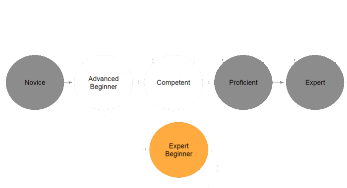
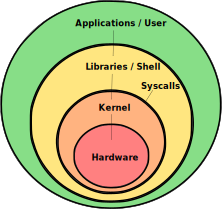
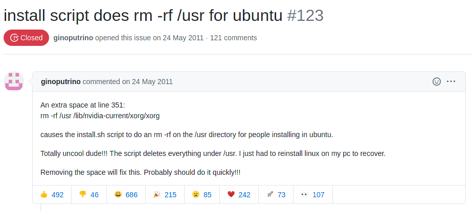
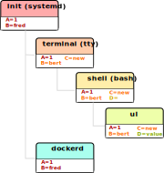
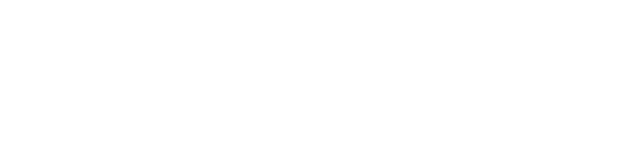

:title: Shell Programming introduction
:data-transition-duration: 1500
:css: hovercraft.css

.. note::

    i3 config:
    bindsym $mod+F5 exec mpv --fullscreen --length=2 ~/badumts.mp4
    https://www.youtube.com/watch?v=kLwmp1PXWsk

----

Welcome 👋
==========

*Expectations:*

.. code-block::

    * You know what a shell is.
    * You know what bash is specifically.
    * You know how to write shell scripts.
    * You won't be an expert in anything.
    * You ask questions immediately.
    * You don't expect this workshop is complete.
    * Some entertainment.

.. note::

    My expectations:

    * You ask immediately when you did not understand something.
    * You can try commands in parallel.
    * You will be tested at the end.
    * You will not need to understand everything, but
      it's good to have a mind map of things that are possible.

    Mythenmetzsche Ausschweifungen all day long.

    Also: First try of those slides. Could happen that I forgot
    something to explain that is obvious to me, but is not for you.
    Please tell me early. I need the feedback to get the knowledge across.

    Remember: Learning bash takes usually long and you just get the intro
    today with the lemur-condensed knowledge. You need to practice it.

    About 60 slides, so even if I do 1 slide per 2 minutes, we'll still end
    up with several hours.

----

After this workshop... 🧪
=========================

.. note::

    You should be able to learn stuff and pick things up.
    I give you pointers on what to learn and can help
    but I can't lear stuff for you.

    You should be an advanced beginner now, don't go to
    an expert beginner afterwards!

    WHAT IS BASH? Please define.

----

What is a shell? 🐚
=======================

.. code-block:: python

    # The dumbest interpreter on earth:
    from shlex import split
    from sys import stdin, stdout
    from subprocess import call

    while True:
        # Draw prompt:
        stdout.write('> ')
        stdout.flush()

        # Start requested program,
        # print to stdout and stderr.
        call(split(stdin.readline()))

----

Why is the shell? 🦐
====================

----

Terminology 🥼
==============

.. code-block::

    shell    := the intepreter.
    bash     := one specific shell.
    script   := list of shell commands.
    terminal := the »UI« of the shell.

----

History ⏳
==========

.. code-block::

    1969: Mainframes with Terminal.
    1977: Bourne Shell (»sh«).
    1987: Bourne again Shell: Bash 1.0
    1990: POSIX Shell Standard.
    1995: Cygwin: Windows compatibility
    2004: Bash 4

.. note::

    Moral of the story: Was intented as language,
    but somehow got a bit out of control and became one.

    Cygwin

    Note that this is a bash workshop but we focus
    on the part that all Posix shells implement.
    There are almost no bash specific features in this workshop.

----

``bash`` > ``python``? 🤔
=========================

.. raw:: html

    

        🤷
    

.. class:: substep

    Nope. The *ba* in *bash* stands for *bastel*.

.. class:: substep

    Do not write large programs in it.

.. note::

    Python's use case is writing small to middle large programs.
    Bash is to write tiny to small programs.

    There's Perl, which is the evil bastard child of both worlds,
    which kinda succeeds in both.

----

The End 🏚
==========

Go learn Python.
----------------

Questions?

----

Bash is »duct tape«... 🖇
=========================

...and an interactive language!
--------------------------------

Several good high potential use-cases:

.. class:: substep

    * Automation
    * Administration
    * Deployment
    * Test suites
    * Oneliners
    * Text-based tasks

.. note::

    glue: not in the sense you can sniff it though.
    Not a programming languages, but rather easy way to integrate
    tools made in different languages.

    Examples in GBS:

    - melon
    - test suite
    - deployment scripts

----

Advantages 👍
=============

.. class:: substep

    * Shell integrates well with other tools.
    * Interactive programming.
    * Bash is everywhere where Linux is.
    * Easy to debug.
    * Well known.
    * Shell is the only IDE you'll ever need.

I postulate:
------------

.. math::

    \frac{loc(python)}{10} > loc(bash)

.. note::

    And other tools include python for more complicated
    automation tasks.

----

Disadvantages 👎
================

.. class:: substep

    - Slow as fuck.
    - Only data type is string.
    - Really bad at math.
    - Plain awkward.
    - Not every program integrates well.
    - Not always portable.
    - Sometimes dangerous.

.. note::

    * Slow -> Not relevant usually.
    * Math -> No floating point. That's annoying.
    * Plain awkward -> And sometimes annoying. Easy to make mistakes.
    * Integration -> Only for unix philosophy programs.

    Little lie: bash also supports integers... kind of.
    But we're not talking about this here and it does not really matter.

----

What? »Dangerous«? 😱
===========================

----

Different Shells 🐌
===================

* Microsoft cmd.exe™
* Windows PowerShell
* Dash: Minimal
* Fish: Feelgood-Shell.
* Zsh: What I use.
* Oil: *Interesting...*

.. note:: bash

    - Nicht immer kompatibel
    - Viele andere, viele die sich nicht verbreitet haben.

-----

Table of Contents
=================

1. Variables
------------

.. note:: How to use variables in bash.

2. Processes
------------

.. note:: All about communication with and between processes.

3. Control
----------

.. note:: Control structure syntax.

4. Lines
--------

.. note:: Working with line separated data.

5. Files
--------

.. note:: Working with files.

6. Misc
-------

.. note:: Collection of tips and tricks.

Practice (optional)
-------------------

.. note:: Actual ticket we can do.

----

0. Preface: Scripts
===================

.. code-block:: bash

    #!/bin/bash
    # I'm a comment.
    # And the first line is a »shebang«.

    # This is a command like you would type it normally:
    echo "not good."

----

0. Help me!
===========

.. code-block:: bash

    man man
    whatis this
    cheese --help

.. note::

    Practice reading a --help output.

----

1. Vars: Basics
================

.. code-block:: bash

    $ PRESCHL="kackvooochel"
    $ echo "Q: Tier des Jahres? A: Der ${PRESCHL}."
    Q: Tier des Jahres? A: Der kackvooochel

.. note::

    - Always key value.
    - You don't have to quote it, but you should.
    - You can write it lower case, but if it's
      used by other parts of a script, upper case is preferred
      to tell it apart it from commands.

----

1. Vars: Inheritance #1
============================

.. note::

    - Processes build a tree.
    - Each process has a list of environment variables (and values)
    - New processes inherit the variables of the previous process.
    - But: Only exported variables get inherited (unexported vars exist only in the shell)

----

1. Vars: Inheritance #2
============================

*Different types in a shell:*

- Exported variables
- Local variables
- Global variables

.. code-block:: console

    # Default: Global variables.
    $ A=1
    $ echo $A
    1
    $ sh -c 'echo $A'
    <empty>
    $ export A
    $ sh -c 'echo $A'

.. note::

    Bash variables start their life not as exported
    (i.e. they don't make it to the process)

    Explain export command here.

    Show that you can also prefix a command with a variable.

----

1. Vars: Substitutions
===========================

.. code-block::

    V="preschl is a droddl"
    echo "${V/droddl/kackvoochel}"
    echo "${W:-default}"
    echo "${W:-${V}}"

More info `here <https://tldp.org/LDP/abs/html/parameter-substitution.html>`_.

----

1. Vars: Special Characters
================================

.. code-block::

    $ | ; & ' " : {} \ > < * ? -- !

.. note::

    Show for example "!" in a double quoted string or "wildcard*".

----

1. Vars: Quoting
=====================

.. code-block:: bash

    "Hello ${who}"  # Several strings belonging together.
    'Hello ${who}'  # Literal strings, no escaping needed.

.. note::

    Prefer single quotes to avoid surprises,
    use double quotes if you need to have

    There are some subtle pitfalls here, but you will pick them
    up along the way.

----

1. Vars: source
================

.. code-block:: console

    $ echo "SOURCED_VARIABLE=kikeriki" > /tmp/my-vars
    $ cat /tmp/my-vars
    SOURCED_VARIABLE=kikeriki
    $ echo "$SOURCED_VARIABLE"
    <empty>
    $ source /tmp/my-vars
    $ echo SOURCED_VARIABLE
    kikeriki

.. note::

    - Important technique!
    - Can also execute code.
    - Often used for configuration.

    Exercise: Name at least one file you source regularly!
    Also one GBS specific.

----

1. Vars: Pre-Existing
=====================

.. code-block:: bash

    $PATH
    $RANDOM
    $HOME
    $PWD
    $USER
    # ...

.. note::

    Explain PATH

    There are more, but those are the important ones.
    Also some are not listed here: $? $0 etc.

----

1. Vars: Exercise
=================

.. code-block:: bash

    # What will this print?
    $ A="${X:-1}"
    $ B="${A:-2}"
    $ echo "${B/2/3}"
    $ /bin/sh -c 'echo ${B/2/3}'

----

2. Processes: Communication
===========================

.. code-block:: console

    $ pstree

.. code-block:: bash

    # Simplest way is to just list individual commands.
    # Oldest bash joke there is:
    unzip;strip;touch;finger;mount;fsck;
    more;yes;fsck;fsck;fsck;umount;sleep

.. note::

    Whenever you type in a command you start a new process.
    Again, processes form a big tree. But often you want
    to communicate and glue processes together to do something cool.

----

2. Processes: Parameters & Arguments
====================================

.. code-block:: console

    $ melon device config set \
        --device 68 \
        -c 'UI_SURVEY_DEFAULT=666'

.. note::

    Argument: Everything in os.Args[1:]
    Option: --device or -c (exists as "flag" or as option with parameter)
    There are short and long options.

    Parameters: Some options (or subcommands) receive additional information.

    => Parameters: '68' is one or 'HEAD' in 'git show'

    »--« Convention

    Split long commands convention

----

2. Processes: Pipes
====================

.. code-block:: console

    $ echo "foo bar baz" | wc -w

.. note::

    Demonstrate lolcat.

----

2. Processes: Streams
=====================

.. code-block:: bash

    # Stdout:
    $ echo "AI = Automated If/else" > file
    # Stdin:
    $ cat < file
    # Hide Stderr:
    $ melon login 2> /dev/null
    # Merge stdout & stderr:
    $ melon blame
    $ echo "ML = More loops" >> file

----

2. Processes: Composition
=========================

.. code-block:: bash

    true && echo 'Hey!'
    false || echo 'Ho'
    echo 'Ha!' ; echo 'He!'

----

2. Processes: Jobs
==================

.. code-block:: console

    $ (sleep 15 && echo 'im late!') &
    $ fg
    <Ctrl-Z>

----

2. Processes: Subshell
======================

.. code-block:: console

    $ melon --token "$(melon login)" device list

----

2. Processes: Exercise
======================

.. code-block:: bash

    # Check if a $DEVICE_ID exists and if yes,
    # assign an update to it.

----

3. Control: if
==============

.. code-block:: bash

    A=1
    if [ "${A}" -gt 0 ]; then
        echo "Wow."
    else
        echo "I can haz math?"
    fi

.. note::

    [ is a command (test)
    true is also a command
    use $? to check the exit code.

    "!" in front negates whatever follows.

----

3. Control: while
=================

.. code-block:: bash

    while ! curl -s www.google.de > /tmp/blah; do
        echo 'retrying in 1s'
        sleep 1
    done

----

3. Control: for
===============

.. code-block:: bash

    for x in "$(seq 0 10)"; do
        echo "${x}"
    done

----

3. Control: case
================

.. code-block:: bash

    space=$RANDOM
    case $space in
    [1-6]*)
      echo "All good."
      ;;
    [7-8]*)
      echo "Start thinking about cleaning out some stuff."
      ;;
    9[1-9])
      echo "Better hurry with that new disk..."
      ;;
    *)
      echo "What is this?"
      ;;
    esac

.. note::

    More explanation on wildcards and regex follow later on.

----

3. Control: Functions
=====================

.. code-block:: bash

    #!/bin/bash

    greeting() {
        echo Hello "$1"
    }

    greeting kackvooochel

----

3. Control: Specials
====================

.. code-block:: bash

    $ timeout 1 ping -c 1 www.bastelbude.de
    $ melon device list --json | \
        jq -r '.[] | .id'      | \
        xargs printf '-d %d'   | \
        xargs -n1 melon ota assign -v xyz

.. note::

    Interesting part of learning a new language is always
    seeing concepts that no other language has.

----

3. Control: Exercise
======================

.. code-block:: console

    # Go over the device list and print the
    # mapping of serial to device id.

----

4. Lines: Globbing
=====================

.. code-block:: bash

    ls /dev/sd?
    ls /dev/sd[a-z][1-9]
    cp report_{old,new}.pdf /tmp
    ls *.md
    ls **/README.md

.. note::

    bash feature, often sufficient.

----

4. Lines: Regex
==================

.. code-block::

    .*        - Match everything
    ^fred$    - Match only "fred"
    \s        - Whitespace
    [0-9a-z]  - lowercase alphanumeric
    {a,b,c}+  - at least one of a b or c
    \{xxx\}   - matches "{xxx}"

.. note::

    Expression = Characters + Controls

    Mention book.

    Warning: Some tools have slightly different dialects of
    regex, some use different escaping rules.

----

4. Lines: grep
=================

.. code-block:: console

    $ grep '<pattern>' /some/file
    $ echo "something" | grep '<pattern>'

.. note::

    Use grepdata.txt from the curl link below.
    - grep for all phne numbers.

----

4. Lines: sed
================

.. code-block:: console

    $ sed -i 's/<pattern>/<replacement>/g' file1 file2 ...
    $ echo 'veni\nvidi\nvomit' | sed '/vomit/d'
    $ echo 'veni\nvidi\nvomit' | sed '3d'

.. note::

    There is a way more powerful tool I called awk,
    but I don't really use it.

.. note::

    Grep all dates and delete the ones not from september.

----

4. Lines: head, tail, cut
=========================

.. code-block:: console

    $ echo 'quod\nerat\ndefectum' | head -1
    quod
    $ echo 'quod\nerat\ndefectum' | tail -1
    defectum
    $ tail -f <file>
    $ tex --version | head -1 | cut -f2 -d' '
    3.14159265

----

4. Lines: sort, uniq, wc
===========================

.. code-block:: console

    $ seq 10 -1 0 | sort
    $ seq 10 -1 0 | sort -n
    $ seq 10 -1 0 | sort | uniq -c
    $ seq 10 -1 0 | wc -l

----

4. Lines: Exercise
==================

.. code-block:: bash

    # 1. Name files matched by this glob pattern:
    ls **/k???v[a-z]*[0-9]

.. code-block:: bash

    # 2. Grep and sort all phone numbers in this file:
    $ curl http://evc-cit.info/cit052/grepdata.txt > t.txt

----

5. Files: Directories
========================

.. note::

    explain directory structure

    dot and dot-dot

    "./x" means x in the current directory (pwd)

    ".x" means it's a hidden directory.

    If a path starts with an / it is an absolute path.

.. code-block:: console

    $ basename /some/long/path  # »path«
    $ dirname  /some/long/path  # »/some/long«

.. code-block:: console

    $ cd [path]
    $ ls [path]
    $ pwd
    $ mkdir <path>
    $ find [path] -iname 'glob'

----

5. Files: I/O
=============

.. code-block:: console

    $ cat [path]
    $ tac [path]
    $ touch [path]
    $ cp <source1> [<source2>] <dest>
    $ mv <source1> <dest>
    $ ln <source> <link-name>
    $ ln -s <source> <link-name>
    $ file [path]

.. note::

    chmod, users etc. I leave that out for now.
    Not because it's not important but because it's kinda boring.

----

5. Files: Exercise
==================

.. code-block:: bash

    # Write a function to check if a file exists and is
    # not a dir and then create an symbolic link with
    # absolute path with the suffix ".link" in the
    # current directory, # pointing to the original file.
    link_me_if_you_can() {
        # ...
    }

    link_me_if_you_can /tmp/test-file

.. note::

    .. code-block:: bash

        link_me_if_you_can() {
            if [ -f "$1" ]; then
                link_name=$(basename "$1").link
                ln -sf "$(realpath "$1")" "./${link_name}"
            fi
        }

----

6. Misc: bashrc
===============

Special file that gets sourced on every new session.

Place those things here:
------------------------

.. class:: substep

    * Utils and aliases.
    * Environment variables that you need to persist.
    * Anything setup related.

----

6. Misc: History
================

.. code-block:: console

    $ history | less

.. note::

    Or what I do: Type the command start and press up.

    Mention pager: more and less (and most)

----

6. Misc: Math
=============

.. code-block:: bash

    $ echo $((1 + 1))
    2

----

6. Misc: jq
===========

.. code-block:: bash

    melon device list --json | \
        jq '.[] | select(.currentVersion|test("330.9.1-.*")) \
                | [.id, .serialNO, .customerID] \
                | @tsv \
                '

----

6. Misc: Shortcuts
==================

.. code-block:: bash

    Ctrl-A = Go to ANFANG
    Ctrl-E = Go to ENDE
    Ctrl-W = Delete WORD
    Ctrl-C = Seng SIGINT to current process
    Ctrl-D = Close stdin (causing EOF)
    Ctrl-Z = Background current process
    Ctrl-L = Clear screen.
    Alt-.  = Repeat last argument.

----

6. Misc: Strict mode
====================

.. code-block:: console

    # Always add this to the top of your scripts:
    $ set -euo pipefail

.. note::

    Also show set -x to enable debugging.

----

6. Misc: Useful stuff
=====================

.. code-block:: console

    $ sleep 1m30s
    $ date +%H
    $ sha1sum <file>
    $ mktemp
    $ df -h <path>
    $ stat [path]
    $ time <command>

----

6. Misc: Useful stuff
=====================

.. code-block:: console

    $ rg <pattern> [<path>]
    $ echo 'fred\nfrodo\nfrater' | fzf
    $ watch -n1 <command>
    $ bat <source-file>
    $ cloc <dir>
    $ htop
    $ rmlint
    $ ranger

.. note::

    Not so much bash but productivity related.

----

6. Misc: Weird stuff
====================

.. code-block:: console

    $ yes
    $ tee
    $ dd if=<path> of=<path> status=progress bs=1M count=10
    $ od
    $ cal

----

6. Misc: shellcheck
===================

.. code-block:: console

    $ shellcheck ~/code/platform/backend/build/*.sh

.. note::

    Whenever you push a shell script or work on it
    I *expect* you to use shellcheck on it.

----

6. Misc: Exercise
==================

.. code-block:: bash

    # What is this doing?
    :(){ :|:& };:

----

Last Words 🌜
=============

Things I left out:

* Arrays.
* User and rights.
* Networking commands.
* Argument Parsing.
* Version control related.
* Containers.
* Debugging / Performance.
* Man pages.
* ...

----

..Questions? 🤪
===============

*Congratulations*  you made it so far.

I trust you can now read the docs.
----------------------------------

.. note::

    blah

----

References 🔖
=============

Bash Bible:
-----------

.. raw:: html

    

        <a class="reflink" href="https://tldp.org/LDP/abs/html/index.html">Advanced Bash Scripting</a>
    

    

Art of Unix Programming
-----------------------

.. raw:: html

    

        <a class="reflink" href="http://www.catb.org/%7Eesr/writings/taoup/html/index.html">Philosophy &amp; History</a>
    

    

----

Practice round 🧨
=================

.. math::

    A = \frac{E[uptime]}{E[uptime] + E[downtime]}

.. code-block::

    Write a script that measures the availability,
    as defined above, for »germanbionic.io« and store
    the results daily in this structure:

    .
    └── <year-number>
        ├── percentage
        └── <month-number>
            ├── percentage
            └── <day-number>
                ├── percentage
                └── log
