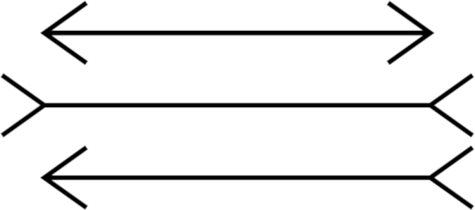
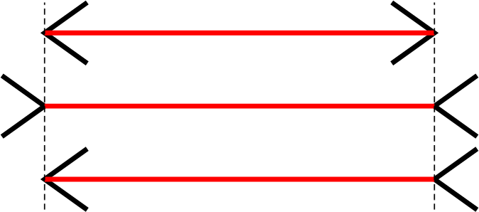
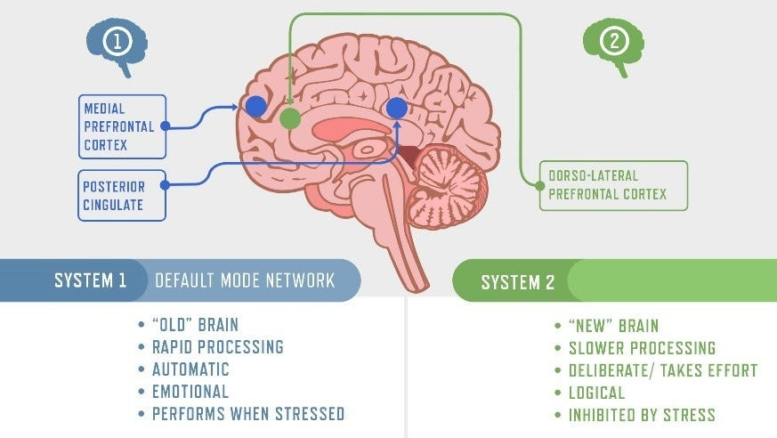
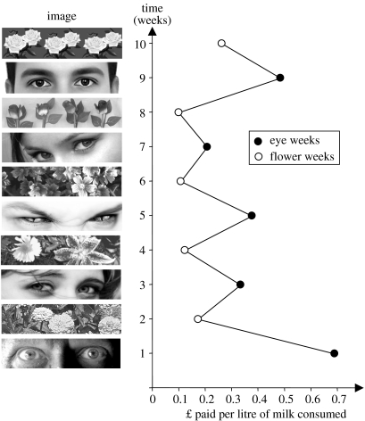

<!-- _class: lead -->

<link rel="icon" type="image/x-icon" href="./favicon.ico">

# Thinking fast and slow

...in software development.

- Summary: What can we do about it? Not so much. Read the book.
  Make it a habit watching your mind. You will still make false decisions
  but you might be more careful and delay decisions.

- Alternatives Format: Adventskalender mit 24 psychischen Effekten.

Globale Quellen:

- <https://en.wikipedia.org/wiki/Cognitive_bias>

Themensammlung:

- statistisches Denken
- Intuition (= langjährige übung)
  Häufiger Aufgabenwechsel ist sehr fordernd.
- Fragenersetzung
- Selbstüberschätzung
- Geschichtenerzähler System 1 ("Bananen" und "Erbrechen")
- Priming (Wahlen in einem Schulgebäude: Viel sozialere Wahl! Wahl in einem Bürgerbüro: Viel mehr Protestwahl)
  Beispiel mit Vertrauenskasse S.78
- Kognitive Leichtigkeit (je leichter die Info abgerufen werden kann, desto eher wird eine Information eingebracht)
- Stimmung (schlechte Stimmung: analytisch, aber auch eher einlenkend - gute Stimmung: kreativ, aber leichtgläubig)
- Überraschung
  (Wie viele Tiere nahm Moses mit in die Arche? -> fehlende überraschung)
- Overconfidence (+ Dunning Kruger Confidence-Expert Kurve)
- Pre-Mortem

- WYSIATI

=============

Analysis Paralysis

- TODO

Complexity & Simplicity Bias

- Complexity in software development is the enemy.

Hindsight Bias:

Curse of Knowledge:

- Beispiel: Senior soll Junior etwas beibringen -> tut sich schwer, weil "Das weiß man doch".
  Oder: Code wird nicht dokumentiert weil es zum Zeitpunkt des Schreibens "offensichtlich" wirkt.
  Später hat man aber den Kontext selbst nicht mehr und blickt nicht mehr durch.
- Quellen:

  - <https://en.wikipedia.org/wiki/Curse_of_knowledge>

New is shiny:

- Beispiel: Neue Tools (damals MongoDB) statt gut abgehangene Software. Lieber neue Features bauen
  als Infrastruktur erhalten (Brücken ;-)
  Gute historische Beispiele: Blockchain, NFTs, Machine Learning.
- Quelle:
  - <https://en.wikipedia.org/wiki/Shiny_object_syndrome>
  - <https://en.wikipedia.org/wiki/Appeal_to_novelty>

Experten:

- Experten nutzen System1 statt mühsam mit System2 eine Lösung zu finden.
- Experten gehen von abstrakt zu konkret. Sie vesuchen immer die
  darüberliegenden Prinzipien zu erkennen, versuchen aber immer durch Beispiele konkret zu werden.
  Beginner versuchen oft Dinge sehr konkret zu erklären.
- Problem solving skills apply only to a specific domain.
  Being good at debugging does not make you good writing software in the first place (well, you
  could say the worse you are at writing software the better you should be at debugging...)
- Beispiel: Schachspieler erkennen Konstellationen auf dem Brett anstatt sie zu
  durchdenken.
- Reading code can be very benefitial to train this pattern matching machinery.

<https://cacm.acm.org/research/10-things-software-developers-should-learn-about-learning/>

Verlustaversion

- Menschen verhalten sich (unter anderem) bei ökonomischen Entscheidungen nicht rational.
- Verluste werden sehr viel stärker gewichtet als Gewinne. (todo: grafik)
- Ausnahme: Möglichkeitseffekt (zB bei Losen - da ist die Chance egal, hauptsache man kann etwas gewinnen,
  der Verlust ist der Kaufpreis des Loses und dafür kauft man sich die Hoffnung auf einen Gewinn)

  - 95% Wahrscheinlichkeit um 10k zu gewinnen. -> Angst vor Enttäuschung, viel Einsatz um die restlichen 5% abzusichern.
  - 95% Wahrscheinlichkeit um 10k zu verlieren -> Riskobereitschaft in der Hoffnung Verluste abzuwenden.
  - 5%  Wahrscheinlichkeit um 10k zu gewinnen. -> Hoffnung auf großen Gewinn, stabilere Wetten werden abgelehnt.
  - 5%  Wahrscheinlichkeit um 10k zu verlierne -> Furcht vor Verlust, lieber Annahme eines Vergleichs vor Gericht zB.

- Quelle: <https://en.wikipedia.org/wiki/Loss_aversion> (<- Grafik hier zeigen!)
  
Sunken Cost Fallacy

- Es werden oft Projekte fortgesetzt die eigentlich schon verloren sind, "da man ja schon so viel investiert hat".
  Diese Verzerrung führt häufig zu irrationalen Verhalten und weiteren Kosten. Die bereits investierten Kosten sind präsenter
  und "schmerzen" mehr als Kosten die noch anfallen werden.

Framing & Format

- Format: Die Präsentation von Daten hat starken Einfluss auf Entscheidungen:

  - Option 1: Patienten wie John begehen mit etwa 10% Wahrscheinlichkeit Straftaten nach der Entlassung.
  - Option 2: Von 100 Patienten wie John begehen ca. 10 Straftaten.
  - Option 2 wurde von Ärzten viel öfters als gefährlicher Patient eingestuft.

- Framing: Einordnung von Daten: Schädlichkeit von E-Autos muss mit Verbrennern verglichen werden.
- Weites und enges Framing. Entscheidungen hängen stark von der "Distanz" ab mit  der man sie trifft.

  - Beispiel: Vorstande mit 25 Managern und einem obersten Chef. Jede Sparte soll eine riskante Option evaluieren
    bei der 25% des Kapitals jeder Sparte verloren geht oder das Kapital verdoppelt wird (50/50 Chance). Jeder einzelne Manager entscheidet sich dagegen (enges Framing),
    der oberste Chef dafür (weites Framing).
    todo: Beispiel ist doof.
  - Enges Framing = Seriel von Teilentscheidungen. Weites Framing = Alle Entscheidungen auf einen Haufen.

- Verluste können oft als "entgangene Gewinne" geframed werden:
  - Option1: Lotterie mit 10% Chance 95EUR zu gewinnen und 90% Chance 5 Doller zu verlieren.
  - Option2: Einsatz 5 Euro. Lotterie mit 10% Chance 100EUR zu gewinnen und 90% Chance nichts zu gewinnen.

  -> Menschen mögen Sicherheit und würden Option 2 nehmen.

- Opt-in vs Opt-out: Opt-out ist deutlich effektiver - siehe die Kirche oder Organspende.

  ->

- Feature Fatique

  Feature Fatigue beschreibt die Unzufriedenheit, Frustration und Überforderung der Nutzer durch zu viele und unklare Features.
  TODO:
  - Quelle: <https://www.richard-seidl.com/additive-bias/>

---------

Das Leben als eine Geschichte

- Entscheidungen treffen wir anhand der Erinnerung an erlebte Ereignisse. Dabei verzerren wir stark.
- Eine Verzerrung ist die Höchstand-Ende-Regel: Man erinnert sich viel primär an das Ende und das intensivste Ereignisse.
  Wenn beides zum Beispiel schlecht war, kann das sogar viele glückliche Erlebnisse komplett überschatten.
- Kaltes-Hand-Experiment:  Probanden müssen ihre Hände in einen Tank mit kaltem Wasser halten.
    1. Erster Durchlauf: 60 Sekunden, konstante Temperatur.
    2. Zweiter Durchlauf: 60 Sekuden wie erster, danach 30 Sekunden mit etwas wärmeren Wasser.

    In Summe war der zweite Durchlauf schmerzhafter, trotzdem würden so gut wie alle Probanden diesen eher
    nochmal erdulden als den ersten.

Zufriedenheit & Wohlbefinden:

- Es gibt einen Unterschied zwischen Wohlbefinden (messbar anhand Tagesbuch) und Zufriedenheit (basiert auf erinnernde Rückschau). Letzteres ist oft stark verzerrt und entsprich selten dem tatsächlichen
  Wohlbefinden. Meist werden die negativen Dinge in Erinnerung gerufen wenn man über seine Zufriedenheit nachdenkt. Auch werden dabei Ereignisse bevorzugt die vor kurzen passiert sind.
- Das lässt sich ausnutzen: In einem Expierment wurden Probanden befragt wie zufrieden sie mit ihrem Leben sind. Alle Probanden fragte man ob sie eine Seite vorher fotokopieren könnten.
  Die Hälfte der Probanden fanden dabei ein 10ct Stück am Kopierer (das dort hingelegt wurde). Diese Hälfte war sehr signifikant zufriedener mit ihrem Leben.
- "Geld macht nicht glücklich" stimmt. Aber Armut macht unglücklich. Ab einem bestimmten Gehalt ist das Wohlbefinden fast exakt gleich, lediglich die selbsteingeschätzte Zufriedenheit steigt noch etwas.
- Das parallele Erledigen von Dingen "verdünnt" lustvolles Erleben. Beim Essen kein Fernseh schauen, aber schmerzhafte Behandlungen: Podcast hören.

Fokussierungs-Illusion:

- Zufriedenheit hängt auch von den verfügbaren Alternativen ab. Ist man zufrieden aber eine bessere Alternative ist verfügbar, dann ist man nicht mehr zufrieden.
  Beispiel: Leute die in einem sehr angenehmen Klima leben bemerken es nicht mehr und sind genauso zufrieden wie Leute mit schlechterem Klima. Trotzdem halten sich Leute mit schlechten Klima fü----------
  unzufriedener und   Menschen in guten Klima für zufriedener.
- Querschnittsgelähmte: Menschen die keinen kennen schätzen die Zufriedenheit dieser Personen schlechter ein als diejenige die eine kennen.
  Man konzentriert sich überproportional auf negative Apsekte und lässt andere Aspekte außer acht.

--->

Primer:

Software development is...

- 30% technical skills
- 65% Psychology
- 25% Made-up statistics

But for real, we talk not enough about the psychological aspects of software
engineering, or engineering in general. I always say "complexity is the enemy"
but I didn't really say yet why. Well, the short answer is: Because our brain
is very limited and we don't have the hardware to accurately judge ourselves.

I'll show you in this talk common traps our mind can go into and some of the
mechanisms behind it. Please don't expect solutions. There are none - for most
of those traps we can only get aware of them, but our brain doesn't really care
about that and will happily fall into the same trap again.

It's based on the book "Thinking fast and slow" by Daniel Kahnemann. If you're
really interested in this kind of stuff I very much recommend reading the book
since it can give you a much better understanding than I could in the relative
short term.

So I hope this talk makes you feel as stupid as I felt when writing this and
I hope having this combined feeling unites and humbles us a bit.

Also, I hope it gets a bit entertaining too.

-->

Can we trust our brain?

----

# Thatcher effect

What's wrong with this picture?

<!--
The Thatcher effect describes the effect that we do not notice obvious errors (i.e. flipped eyes and mouth regions) when the face itself is flipped.
It is a "bug" in our face detection system and no matter how much we know that the error is there, we won't really see it. It's like a part of our brain
is on auto-pilot - it works most of the time, but when it doesn't we can't do anything against it.
-->

---

# Thatcher effect

Dear lord.

---

# Müller Lyer Illusion

Which one of the three arrows has the longest middle line?

<!--
The Müller Lyer illusion shows a few lines with differently oriented arrows. The lines are all the same length, but they
do not appear to be like that, even we know this is an optical illusion.
-->

---

# Müller Lyer Illusion

You still have a feeling they're different length, right?

<!--
Just to prove to you that the length is actually the same.
-->

---

<!--
Two subsystems in our brain. We saw mostly System 1 now at work.
-->

---

# System1 at work

<!--
Banana and vomit: The slide does not make any correlation between those terms, but still your brain
invented a "story" to link between those images. This story probably explains why someone vomitted from eating banana
and it will leave a distaste for banana even after hearing this presentation. I'm sorry.
-->

---

# System 2 at work

$$
17 \times 24 ?
$$

<!--
It's 408, please stop calculating now.
-->

---

# Priming: Election

🏫 vs ⛪

<!--

We always assume that we have something like free will. But free will is often suspected to be an illusion - at the very least though
we are heavily influenced by our surroundings.

A study [1] showed that voting in a shool yields much higher affirmity to voting for educational policies
than voting elsewhere. Voting at the church in contrast yielded much more conservative views.

[1]: https://www.ncbi.nlm.nih.gov/pmc/articles/PMC2449328/
-->

---

# Priming: The art of feeling watched

<!--
If you ever need to operate something where people can take goods and need to pay
for them based on trust then I have a tip for you:
you should think about using the priming effect for your
advantage. Another study[2] used the pictures of those images beside the graph to
imply that you're being watched (with flowers as baseline). The results speak for itself:
customers gave a lot more money when they were primed to being watched.

[2]: https://pubmed.ncbi.nlm.nih.gov/17148417/

Does this apply to software development also? Yes! If you know that your code
is being subject to review then you'll develop differently (and probably better!) (and probably better!)  than for a toy project
that is just for yourself.

TOOD: Include the "bread and B _ _ T _ R" example as well?
-->

---

# Math

A baseball-bat and a ball costs 1.10 EUR.
The bat costs 1 EUR more than the ball.
How much does the ball cost?

<!--

Instructions: Just ask for the answer. It will be most likely "10 cent", which is wrong.
System1 answered here, because the task felt similar to other tasks we've seen in life.

The actual answer is 5 cent (bat is 1.05 cent)
-->

---

# Some more math

- 2+2
- 3*3
- 20+13
- 77+33
- 550/2
- 18*23

<!--
Instruct people to walk in circles around in the room
(or alternatively make them tick every second)

Easy tasks can be handled by System 1, but harder calculations
have to be done by System 2 - which in turn blocks most other systems, you can't even walk properly.
-->

---

# Cognitive load

<https://github.com/zakirullin/cognitive-load>

---

# Intuition

statistics thinking:

"Smoking reduces the chances for Alzheimer"

-> Because Alzheimer occurs more often with high age and smoking lowers life expectancy.

----

# Dunning Kruger

Very prevalent in software development. As a junior people tend to say "oh, that's easy you just have to..." and three weeks later you get a hour long
explanation that it's almost finished but there's just this small thingy preventing it from being released - which turns out to be the hard thing that has been missed up front.
